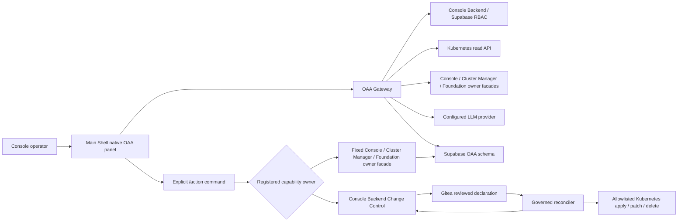

# OAA Control Plane 종합 검토 보고서

Date: 2026-07-23  
Scope: Main Shell OAA UI, OAA Gateway, Console Backend, Supabase, Gitea, governed reconciler, live Kubernetes runtime

## 결론

OAA는 Console에 내장된 단순 LLM 채팅창이 아니다. UI는 Main Shell native component이고, 보안 경계와 실행은 별도 Kubernetes workload가 담당한다.

- `os-oaa-agent`: Main Shell native UI. 별도 subShell이 아니다.
- `opensphere-console-oaa-gateway`: LLM key custody, 권한 필터, live read tool loop, 지식 검색, Supabase 증적을 담당하는 별도 2-replica workload.
- `opensphere-console-backend`: Supabase identity/RBAC, 감사, Change Control, Gitea 변경 제안을 소유하는 별도 workload.
- `oaa-governed-adapter`: 승인·merge된 선언만 claim하여 허용된 Kubernetes 변경을 수행하는 별도 least-privilege workload.
- `foundation-oaa-owner`: Foundation이 소유하는 폐쇄형 owner API. UI·generic Kubernetes proxy·exec·background loop를 비활성화한 2-replica workload이며 Gateway만 NetworkPolicy로 접근한다.
- `opensphere-his-binding-controller`: Cluster Manager/HIS가 소유하는 최소권한 controller. live Prometheus query, StatefulSet/Deployment readiness와 synthetic canary를 검증해 cluster-scoped `ObservabilityBinding`을 지속 발급·갱신한다.
- Supabase: identity, permissions, knowledge, runtime projection, usage/agent/tool/retrieval evidence, change outbox의 영속 authority.

현재 OAA는 **실제 운영 상태를 조회하고, 헌법이 허용한 OpenSphere 운영 변경을 승인된 제어 경로로 실행하는 운영 Agent**다. 읽기는 5개 OpenSphere namespace와 cluster-scoped 자원에서 32개 Kubernetes 자원군, Gateway replica당 124개 watch stream을 포괄한다. 변경 대상은 Backend/Reconciler가 소유하는 3개 Console namespace로 별도 제한한다. 일반 workload뿐 아니라 `PlatformSupportProfile`, `ObservabilityBinding`, UI plugin Package/Registration, Foundation Model/Descriptor, Foundation·IdentityDirectory Claim/Binding의 변경도 추적한다. 또한 Console lifecycle, Main Shell Registry, Cluster Manager HIS/Ceph, Foundation, Supabase, Gitea, HIS Binding, consumer contract, notification, Extension Host와 canonical catalog를 각 소유 API를 통해 조회한다. Kubernetes 변경은 Gitea/two-person/reconciler로, owner lifecycle 변경은 고정된 Console/Cluster Manager/Foundation facade로 분리한다. 지원 변경은 workload restart/scale/image update/image rollback, allowlisted resource server-side apply/protected delete, CronJob run/suspend, Platform readiness preflight/verify, Extension lifecycle과 exact-digest 공급망 검사·폐기, Notification channel enable/disable/test와 failed delivery retry, HIS canary/lifecycle 및 Observability read/plan/configure, owner-staged SecretRef 기반 Ceph plan/connect와 remote-data 보존 disconnect, Foundation engine enable/disable, parameter-free FoundationClaim create/release, typed Samba-AD IdentityDirectoryClaim create/release, Console 사용자 생성·활성화·역할 관리, OAA 증적 보존/legal-hold 정책 변경이다. 호스트 임의 shell, Secret 원문, 임의 SQL/REST는 제어 capability가 아니라 보안 우회이므로 계속 금지한다.

## 실행 구조

## 검증 결과

| 영역 | 판정 | 확인 내용 |
|---|---|---|
| UI 배치 | PASS | 3840px viewport에서 OAA panel 612px, main right edge 3840→3220px. overlay가 아니라 workspace를 실제로 축소함. |
| 실제 상태 조회 | PASS | 채팅에서 `get_deployment_rollout`가 호출되어 Gateway Deployment 2/2 Ready, generation/Pod 상태를 live API로 확인함. |
| 통합 제어면 진단 | PASS | `get_control_plane_status`가 Console lifecycle, Cluster Manager HIS/Ceph, Foundation, Supabase, Gitea, HIS Binding, contracts, notifications, Extension Host를 사용자 bearer와 owner API로 조회함. |
| Registry/실행 현실 분리 | PASS | `get_opensphere_registry`는 Main Shell owner API, `search_catalog_entities`는 선언 topology를 조회하고 Kubernetes/owner facade 결과만 live state로 취급함. Registry를 write authority나 Kubernetes runtime truth로 사용하지 않음. |
| LLM agent loop | PASS | 호출 가능한 read tool을 현재 사용자 permission으로 필터하고, 다중 tool round와 tool result를 provider에 반환함. |
| mutation·credential 격리 | PASS | Gateway는 Kubernetes patch 불가. Reconciler만 세 Console namespace에서 자원별 get/create/patch/delete를 보유하고 Secret/Node/RBAC 변경과 PVC delete는 불가. Provider key는 전용 `opensphere-oaa-credentials` namespace에만 존재하며 Gateway/Backend는 Console auth·TLS·Gitea·Supabase·notification Secret을 읽을 수 없다. |
| 승인 실행 경로 | PASS | Supabase outbox claim → Gitea exact commit/manifest 검증 → typed reconcile → observed state 검증 → receipt 경로가 배포됨. |
| owner lifecycle 실행 | PASS | Platform preflight/verify, Extension install/enable/disable/uninstall/rollback, HIS validate/install/upgrade/recover/rollback/uninstall, Foundation engine enable/disable, FoundationClaim 및 typed IdentityDirectoryClaim create/release가 고정 URL·폐쇄 catalog·AAL2·사유·정확한 확인·owner 감사 경계로 연결됨. 사용자 URL/path/parameters 전달은 거부함. |
| Extension 공급망 제어 | PASS, AUTH E2E PENDING | exact `ghcr.io/opensphere-platform/*@sha256:*` inspection과 append-only revocation을 DUPA owner facade로 연결했다. Gateway와 DUPA가 permission·closed schema를 이중 검증하고 revoke는 AAL2·사유·정확한 확인을 요구한다. tag/channel, 다른 repository replacement, registry token 입력은 거부한다. |
| Notification 운영 제어 | PASS, AUTH E2E PENDING | 수신자·본문·route·provider message ID를 제거한 상태 조회와 configured channel enable/disable/test, failed/dead-letter retry를 Backend owner facade로 연결했다. Gateway와 Backend가 permission·AAL2·사유·정확한 확인을 이중 검증하며 SMTP/recipient/credential 입력은 받지 않는다. |
| HIS 고급 구성 | SOURCE PASS, SIGNED LIVE PROMOTION PENDING | 전체 closed schema의 config read/plan/configure를 분리했다. Gateway와 Cluster Manager가 `console.his.read/manage`, AAL2, SecretRef-only, public exposure와 data-reset의 정확한 확인을 이중 검증한다. 구버전 signed owner는 capability probe 404로 자동 숨겨진다. |
| Ceph owner 제어 | SOURCE PASS, ROOK/SIGNED LIVE PREREQUISITE PENDING | raw provider export는 Console 관리자 UI에서 1시간 TTL의 전용 Kubernetes Secret으로 staging하고 OAA에는 UUID 형식 SecretRef만 전달한다. 사용 성공 시 즉시 삭제하고 만료 import는 15분 주기 owner cleanup과 다음 staging 시 정리한다. plan/connect/disconnect는 `console.ceph.read/manage`, AAL2, closed schema, exact confirmation을 이중 검증한다. Rook operator 설치/삭제는 Agent에서 제거해 signed platform release 소유로 고정했고 runtime RBAC/CRD/operator가 준비되지 않으면 capability를 발행하지 않는다. |
| 운영 데이터 갱신 인식 | PASS, event-driven | replica당 124개 Kubernetes watch/resourceVersion stream이 일반 자원, OpenSphere lifecycle CR과 HIS `ObservabilityBinding` 변경을 즉시 투영하고, 60초 full resync가 유실·재연결을 복구한다. Owner API 진단도 상태 digest가 바뀔 때만 append-only event를 만든다. |
| Console Identity owner control | PASS, AUTH E2E PENDING | PII를 제거한 user/role 조회와 사용자 생성·enable/disable·canonical role membership을 fixed Backend facade로 제공한다. `console.identity.manage`, mutation AAL2, 정확한 확인, 사유, self-disable/self-demotion, 마지막 활성 관리자 보호를 강제하며 recovery link/email은 LLM 조회 결과에 포함하지 않는다. 무인증 Gateway/Backend 호출은 401이며 실제 사용자 mutation E2E는 재로그인이 필요하다. |
| Supabase 증적 | PASS, AUTHENTICATED NEW-RUN E2E PENDING | `agent_run`, `agent_step`, `tool_run`, `retrieval_trace`, `llm_usage_event`를 `agent_run_id`로 상관하는 코드·schema·Admin 화면을 배포했다. prompt/response/raw log/API key는 저장하지 않고 digest/metadata만 저장한다. migration 이전 역사 row는 신뢰할 수 있는 run ID로 소급 연결하지 않았고, 배포 후 인증된 새 채팅 run의 live 상관 E2E는 재로그인이 필요하다. |
| 증적 보존 제어 | PASS, PURGE OWNER PENDING | 6개 stream별 30–3650일, `retain|export-before-delete`, legal hold, due/export coverage를 Supabase policy와 append-only policy event로 관리한다. OAA에는 purge API가 없고 export receipt+reviewed owner maintenance 없이는 삭제하지 않는다. |
| 지식 갱신 무결성 | PASS | chunk를 SHA-256 document revision별 불변 row로 보존하고 current revision만 active. 과거 retrieval evidence가 참조한 chunk를 삭제하지 않음. |
| semantic vector search | DEGRADED | 활성 embedding key/model이 없다. PostgreSQL lexical search는 정상이며 hash vector를 semantic evidence로 위장하지 않음. |
| OpenSphere OS 제어 | PASS, 헌법 경계 | Console namespace의 일반 운영·복구 자원을 capability 방식으로 제어한다. 임의 host shell/Secret/SQL은 의도적으로 비-capability다. |
| SecurityPolicy evidence | PASS, live red-test | Console controller가 canonical Deployment의 필수 Manual 계약을 제거한 UPDATE를 `dryRun=All`로 API Server에 제출하고, 정확한 ValidatingAdmissionPolicy Deny 응답을 요구한다. 정책·binding·workload UID/resourceVersion과 결과를 SHA-256 evidence digest로 결합하며 실제 object는 변경하지 않는다. |
| OAA controlled mutation gate | READY, USER E2E PENDING | OAA의 Kubernetes 직접 write는 영구 차단되어 있고 Backend/Gitea/reconciler 제출 경계는 Cluster Manager Activated + HIS Binding Connected를 요구한다. 두 prerequisite는 현재 Ready다. 다만 만료된 사용자 session 때문에 실제 사용자 권한/AAL2/two-person 흐름의 최종 실행 E2E는 아직 재검증하지 못했다. |
| Platform Support Profile | DEGRADED 2/4 | 자동 status reconciler가 현재 증거를 반영한다. Delivery=True, SecurityPolicy=True, Observability=False(logs/traces/OTLP 없음), BackupRestore=False(Storage/Gitea restore evidence 미승격)다. 따라서 Foundation 활성화/PFS domain admission은 계속 fail-closed다. |

## 운영 중 변경 데이터 처리

OAA의 runtime 인식 경로는 다음과 같다.

1. Gateway가 5개 read-allowlisted OpenSphere namespace와 cluster-scoped 운영 자원에 대해 Kubernetes watch를 연다. 변경 계약은 이와 분리된 3개 Console namespace에만 적용된다.
2. `ADDED/MODIFIED/DELETED`를 sanitize하고 `resourceVersion`과 함께 `oaa.runtime_resource`에 즉시 반영한다.
3. 변경 payload는 저장하지 않고 digest·kind·target·health만 `oaa.runtime_event`에 append-only 증적으로 남긴다.
4. `oaa.watch_cursor`에 Gateway replica별(`observer_id`) stream resourceVersion, 상태, 재연결 횟수, 마지막 이벤트 시각을 15초 bulk heartbeat로 유지한다. 이벤트마다 124개 stream이 DB connection을 경쟁하지 않으며, 각 replica가 자기 124개 cursor를 모두 영속화해야 Ready가 된다. 종료 중 replica가 건강한 replica의 상태를 덮지 못한다.
5. 60초마다 32개 자원군 full resync를 수행해 watch gap과 삭제 유실을 보정한다.
6. 채팅 read tool은 Kubernetes live API를 우선 사용하고, 장애 시 fresh Supabase projection을 source 표시와 함께 사용한다.
7. 관리자가 통합 제어면을 진단하면 Main Shell Registry와 Foundation을 포함한 11개 owner facade 결과를 재귀적 민감 키 제거 후 `source=owner-api`, `kind=ControlPlaneAuthority`로 투영한다. 상태 digest가 달라진 경우에만 `runtime_event`를 추가한다.
8. owner API가 장애이면 마지막 Supabase 관측값을 `lastKnown`, `stale=true`, `lastObservedAt`으로만 제공한다. 이를 현재 상태로 승격하지 않는다.
9. tool/agent/retrieval/provider usage는 하나의 `agent_run_id` 아래 별도 append-only evidence로 남고 Admin 화면에서 revision까지 상관된다.

최종 live 검증에서 배포된 Gateway v0.38, Console Backend v0.8, Console UI와 DUPA/Foundation owner facade는 각각 2/2 Ready이고 HIS Binding controller는 1/1 Ready다. Kubernetes `runtime_resource` 최신 조회는 rolling 직후 363/363 객체가 fresh였고, 객체 수는 Pod 생성·종료에 따라 변한다. 두 현재 Gateway observer × 124 stream = `watch_cursor` 248/248 `watching`, error 0으로 수렴했다. `ObservabilityBinding/opensphere-console`도 `health=Ready`, `phase=Connected`, capabilities `metrics/alerting/dashboards`, unavailable `logs/traces/otlp`로 Supabase에 즉시 투영됐다. `PlatformSupportProfile`은 controller가 증거 변화 때 자동 status reconcile하며 final phase `Degraded`, Delivery/SecurityPolicy True, Observability/BackupRestore False다. 두 replica의 중복 status write는 canonical 비교로 수렴해 resourceVersion이 불필요하게 증가하지 않는다. 재시작 시 watch는 resourceVersion으로 정상 재연결했으며 종료된 observer cursor는 증적으로 보존된다. live registry는 60개 tool, 54개 action binding이며 지식은 51 documents / 377 active chunks다. 새 release-bound structure reconcile 후 concept 13개와 relation 50개 모두 explicit seed ownership/checksum을 가진다. 새 HIS/Ceph 항목은 registry에 저장되지만 old signed owner가 capability를 게시하기 전에는 사용자별 manifest와 Agent tool 목록에서 자동 제외된다. Recovery status/plan 도구도 registry에 저장됐고 migration 0022의 `console.recovery.read`가 admin/operator에 적용됐지만, live canonical recovery ConfigMap은 아직 Gitea 승격 전 schema v1이므로 freshness policy 부재와 Storage/Gitea restore blocker를 숨기지 않는다. 증적 보존 policy는 6/6 존재하고 live row count/due/export coverage를 계산한다. migration 적용 시 역사 row는 agent run 2, step 21, tool 12, retrieval 4, provider usage 541이었고 새 `agent_run_id` 상관 row는 0이었다. 과거 evidence를 추측으로 backfill하지 않았으며, 인증된 배포 후 첫 새 채팅 run이 retrieval/tool/provider correlation을 실제로 생성하는지는 사용자 재로그인 뒤 확인해야 한다. 두 Gateway replica가 같은 event를 관측해도 `(event type, kind, namespace, name, resourceVersion)` unique key로 증적 중복을 제거한다. 배포 후 사용자 session이 만료되어 인증된 통합 상태 호출을 임의 credential로 우회하지 않았으며, Backend Recovery capability/status route의 무인증 호출은 모두 401로 차단되는 것을 확인했다.

후속 안정화 snapshot은 362/362 fresh, 두 v43 replica 각각 local watch 124/124, aggregate observer stream 248/248, error 0이었다.

## Supabase 사용 평가

Supabase는 보조 DB가 아니라 OAA의 주요 control/data plane으로 실제 사용된다.

| Supabase 영역 | 사용 수준 | 역할 |
|---|---:|---|
| Identity/RBAC | 높음 | 모든 OAA API에서 현재 session, group, permission을 검증하고 fail-closed 처리 |
| Knowledge | 높음 | manual/project 문서의 active revision을 서비스하고 이전 revision chunk는 immutable history로 계속 보존 |
| Runtime projection | 높음 | 32개 자원군의 live Kubernetes 상태, OpenSphere lifecycle/HIS Binding CR, owner API 진단의 expiring fallback projection |
| Runtime event/cursor | 높음 | append-only change digest와 replica당 124개 watch stream liveness/cursor |
| Agent evidence | 높음 | `agent_run_id`로 run/step, tool run, retrieval revision, provider token usage 상관; stream별 보존/legal-hold/export coverage |
| Change Control | 높음 | change request, approval, outbox claim, reconciler receipt correlation |
| Semantic pgvector | 낮음/Degraded | schema는 준비됐지만 실제 embedding provider가 없어 lexical ranking 사용 |
| HIS telemetry 대체 | 사용하지 않음 | metrics/log authority는 HIS이며 Supabase가 이를 복제해 소유하지 않음 |

지식 갱신 구조는 migration `0015_oaa_knowledge_revisions.sql`, runtime watch는 `0016_oaa_runtime_watch.sql`, replica 동시성 보정은 `0017_oaa_watch_observer.sql`, owner API projection index/authority 설명은 `0018_oaa_owner_api_projection.sql`, agent evidence 상관·보존 정책은 `0019_oaa_evidence_correlation_retention.sql`, Extension/Notification conversational owner 권한은 `0020_oaa_owner_control_permissions.sql`, HIS/Ceph infrastructure owner 권한은 `0021_oaa_infrastructure_owner_permissions.sql`, Platform Recovery read/plan 권한은 `0022_oaa_recovery_owner_permissions.sql`로 관리한다.

- key: `(document_id, document_revision, chunk_index)`
- current serving selector: `active=true`
- 이전 revision: immutable 보존
- retrieval evidence: `document_id`, `chunk_id`, `document_revision`
- 문서 제거: delete가 아니라 retired + inactive
- 동일 content hash 재시드: chunk/embedding rewrite 없이 metadata만 갱신

## Target Control Contract

**목표 제어 계약**

### 기존 owner API의 대화형 제어 커버리지

“OS의 모든 제어”를 기존 Admin endpoint의 무차별 proxy로 해석하면 현재 OAA는 완전하지 않으며, 그렇게 만드는 것도 안전하지 않다. 코드 기준 전체 owner surface를 다시 대조한 결과는 다음과 같다.

| Owner surface | 현재 대화형 제어 | 판정과 필요한 계약 |
|---|---|---|
| Console workload/Kubernetes 운영 | 조회, restart/scale, digest image update/rollback, allowlisted apply/protected delete, CronJob run/suspend | 등록 capability 범위에서 완료. write는 Gitea/two-person/reconciler 경로만 사용한다. |
| Platform readiness | status, preflight, verify | 완료. AAL2·사유·정확한 확인과 owner audit를 재검증한다. |
| Extension lifecycle | registration status, install/enable/disable/uninstall/rollback, exact-digest inspect/revocation | 완료. 공급망 조회는 operator/admin, append-only revoke는 AAL2 admin capability다. registry username/token 설정은 raw credential 경계이므로 Console-native custody로 유지한다. |
| Console Identity | sanitized inventory, create, enable/disable, canonical role add/remove | 완료. email은 생성 입력에만 사용하고 inventory/recovery link/password에는 노출하지 않는다. |
| Notification delivery | sanitized channel/rule/delivery 조회, configured channel enable/disable/test, failed/dead-letter retry | 운영 제어는 완료. channel/rule 생성과 SMTP 변경은 credential·recipient·message policy를 포함하므로 Console-native custody로 유지하며, 향후 SecretRef 기반 별도 계약 없이는 채팅 입력으로 승격하지 않는다. |
| Cluster Manager HIS | status, canary validate, managed lifecycle, fixed-template logs/traces, Observability config read/plan/configure | source 완료. full closed schema, SecretRef-only, public/data-reset confirmation과 owner capability negotiation을 구현했다. signed Cluster Manager promotion 전에는 Gateway가 자동 숨긴다. |
| Cluster Manager Ceph | status, owner-staged SecretRef plan/connect, remote data 보존 disconnect | source 완료. providerExport 원문은 non-chat 관리자 UI→전용 Kubernetes Secret으로만 이동하고 OAA에는 importRef만 제공한다. signed Rook operator, CRD와 최소권한 runtime RBAC가 모두 Ready일 때만 connect/disconnect capability를 발행한다. |
| Foundation owner | status, 7 engine lifecycle, parameter-free FoundationClaim 및 typed IdentityDirectoryClaim create/release | 게시된 전용 OAA owner route는 모두 연결됐다. 임의 engine parameter와 credential 입력은 별도 schema/SecretRef가 생길 때까지 제외한다. |
| LLM provider key custody | provider readiness와 sanitized status | raw key create/update/delete는 Console-native Admin UI만 사용한다. OAA 자신에게 자기 credential을 대화로 읽거나 쓰게 하지 않는다. |
| OAA evidence | correlated status와 retention/disposition/legal hold 변경 | 정책 제어는 완료. export worker·receipt·reviewed purge maintenance는 미구현이며 OAA에는 delete endpoint가 없다. |
| Platform Recovery | Supabase DB/Storage/Gitea backup 검증·restore assertion·freshness 조회, 격리 drill 계획 | `status-read`, `plan-read`를 구현했다. vault 위치·checksum 값·archive·credential은 반환하지 않는다. signed isolated executor가 없으므로 `drill-request`, `evidence-promote`는 capability로 발행하지 않고 Complete Agent blocker로 남긴다. |
| Gitea/change/reconcile 내부 API | change status와 승인된 Kubernetes 변경 제출 | 사용자 action 경로는 완료. webhook, reconcile claim/receipt 같은 server-to-server route는 OAA가 호출할 수 없다. |

따라서 현재 판정은 **등록된 capability의 운영 Agent는 구현됨, 기존 모든 관리자 기능의 대화형 전환은 미완료**다. 후자는 결함을 감추는 generic REST/shell proxy가 아니라 위 표의 secret-free owner facade를 하나씩 추가해 완성해야 한다.

### Console Identity owner control

OAA의 Console Identity 기능은 Supabase Admin API를 LLM에 노출하는 generic proxy가 아니다. Gateway가 다음 네 가지 capability만 게시하고 Console Backend가 동일한 입력을 다시 검증한다.

- `oaa.identity.status`: `console.identity.manage` 권한이 있는 사용자에게 UUID·username·display name·enabled·canonical role만 반환한다. email, recovery/onboarding link, credential은 제외한다.
- `oaa.identity.user.create`: email·username·display name·`console-admins|console-operators|console-viewers` 목록만 받는다. 생성 후 recovery link나 password를 반환하지 않는다.
- `oaa.identity.user.enabled`: UUID 대상의 enable/disable만 허용하며 self-disable과 마지막 활성 관리자 disable을 차단한다.
- `oaa.identity.role.membership`: canonical role 하나의 add/remove만 허용하며 admin self-demotion과 마지막 활성 관리자 demotion을 차단한다.

세 mutation은 HIS가 degraded여도 Console identity recovery를 막지 않도록 독립 owner gate를 사용하지만, global action-submission switch, `console.identity.manage`, AAL2, 8자 이상 사유, exact confirmation, closed schema는 항상 강제한다. 임의 URL/path, Supabase SQL, recovery link 발급은 capability가 아니다.

### Agent evidence correlation and retention

한 번의 provider-backed 채팅은 UUID `agent_run.id`를 먼저 생성한 뒤 검색·provider round·read tool을 실행한다. `retrieval_trace.agent_run_id`, `tool_run.agent_run_id`, `llm_usage_event.agent_run_id`가 같은 run을 가리키므로 Admin의 **Agent Evidence** 탭과 `oaa.evidence.status`가 다음을 재구성할 수 있다.

- LLM round와 tool step 순서, 성공/실패
- 검색에 사용한 source/chunk rank와 불변 `document_revision`
- 실행된 tool ID, target, permission, input/result digest
- provider/model/operation/token/latency 사용 증적

prompt, response, credential, raw log는 저장하지 않는다. `oaa.evidence.retention.update`는 6개 stream의 retention days(30–3650), `retain|export-before-delete`, legal hold만 바꾸며 AAL2·사유·exact confirmation을 요구한다. 이 변경은 append-only policy event로 남는다. OAA에는 purge API가 없으며, 만료 row가 있어도 export receipt와 reviewed owner maintenance가 없으면 삭제할 수 없다.

### 가능한 작업

- live environment/namespace/cluster pod summary
- Pod, Service/EndpointSlice, ConfigMap key metadata, Deployment/StatefulSet/DaemonSet/ReplicaSet, Job/CronJob, Ingress/NetworkPolicy, HPA/PDB, PVC/PV/StorageClass, Node/Namespace, CRD/APIService 조회
- 자원별 sanitized 상세와 최근 Event, workload rollout, redacted Pod logs
- HIS owner API의 fixed-template 중앙 로그(`service.recent`, `service.errors`, `namespace.recent`)와 분산 trace(`trace.by_id`, `service.recent`) 조회. 임의 LogQL/TraceQL/URL은 입력할 수 없음
- Manual/knowledge ACL 검색
- Change Control/Gitea 상태 조회(관리자)
- Platform Readiness, Cluster Manager HIS/Ceph, Supabase, Gitea, HIS Binding, consumer contract, notification, Extension Host 통합 상태 조회(관리자)
- canonical OpenSphere catalog entity 검색과 live runtime evidence 교차 확인
- Main Shell native Registry의 현재 activation/discovery projection 조회
- Foundation owner API의 model/engine/Claim/Binding/controller 상태 조회
- PlatformSupportProfile, HIS ObservabilityBinding, UIPlugin Package/Registration, Foundation Model/Descriptor, Foundation/IdentityDirectory Claim/Binding의 sanitized 조회·변경 인식
- AAL2 관리자 + 사유 + 정확한 확인으로 Platform Support Profile preflight/verify
- 등록 Extension의 install/enable/disable/uninstall/rollback
- 폐쇄 HIS catalog canary validation, HelmManaged install/upgrade/recover/rollback/uninstall 및 SecretRef-only Observability config read/plan/configure
- owner-staged SecretRef 기반 external Ceph plan/connect와 remote data를 보존하는 managed disconnect
- 폐쇄 catalog의 Foundation engine enable/disable
- preserve-unknown parameters를 받지 않는 `identity|data` FoundationClaim create와 finalizer-backed release
- provider를 `samba-ad`로 고정하고 parameters/consumerRef/realm을 받지 않는 typed IdentityDirectoryClaim create/release
- PII-minimized Console user/role 조회와 AAL2 기반 사용자 생성·enable/disable·canonical role membership
- agent run/tool/retrieval revision/provider usage 상관 조회와 증적 보존/legal-hold 정책 변경(삭제는 수행하지 않음)
- Supabase database·Storage·Gitea의 checksum 존재/검증, structured restore assertion, freshness를 정제해 조회하고 `all|supabase-database|supabase-storage|gitea` 단위의 비파괴 격리 복구 drill을 계획(실행은 아직 제공하지 않음)
- 명시적 command + 사유 + 정확한 확인 + AAL2 + 제2 운영자 승인 후 workload restart/scale
- digest-pinned container image update와 이전 승인 요청을 상관한 rollback
- 64 KiB 이하 allowlisted Kubernetes manifest server-side apply
- impact/recovery plan/backup reference/precondition/foreground propagation이 있는 protected delete
- CronJob one-off Job 실행과 suspend/resume
- 관리 권한에 따른 manual knowledge ingest

### 의도적으로 제공하지 않는 우회 경로

- Secret 읽기·쓰기
- host OS process/package/network/filesystem의 임의 제어
- 임의 `kubectl apply`, shell, SQL 실행
- RBAC/Node/PV/CRD 자체 mutation
- 승인되지 않은 image tag(`latest` 포함)와 Secret-like manifest field

임의 shell/kubectl을 LLM에 직접 제공하는 방식은 감사·최소권한·two-person approval을 무력화하므로 금지해야 한다. 전체 제어는 wildcard 권한이 아니라 **등록 capability의 합**으로 완성해야 한다.

## 이번 검토에서 수정한 핵심 결함

1. Provider `/models` 성공만으로 embedding ready라고 판단하던 오류를 실제 `/embeddings` probe와 vector dimension 검사로 변경.
2. fake hash embedding을 제거하고 PostgreSQL lexical fallback으로 변경.
3. 사용자 permission에 따른 실제 multi-round read tool loop 구현.
4. DeepSeek DSML text tool-call을 표준 tool call로 정규화하고 malformed envelope는 fail-closed 처리.
5. 동일 tool+arguments 반복 호출을 캐시하고, 반복 시 검증된 evidence만으로 no-tool 최종 synthesis를 수행하도록 변경.
6. runtime projection과 agent evidence schema 추가.
7. append-only evidence와 충돌하던 manual chunk delete/reseed를 immutable revision 방식으로 변경.
8. 승인 outbox를 실제로 처리하는 governed reconciler를 추가.
9. OAA panel이 desktop workspace를 밀어내는 layout contract와 테스트를 적용.
10. 32개 Kubernetes 자원군 read catalog와 민감 필드 제거 projector를 추가.
11. Kubernetes watch/resourceVersion → Supabase projection/event/cursor를 추가.
12. restart/scale/update/rollback/apply/delete/CronJob capability와 전용 least-privilege RBAC를 추가.
13. Gateway와 Backend 모두 live Cluster Manager/HIS lifecycle을 확인하는 이중 write gate를 추가.
14. owner API 기반 통합 control-plane status와 canonical catalog 검색 tool/binding을 추가.
15. Platform Support, Extension, Foundation lifecycle CR을 watch catalog에 추가하고 5개 OpenSphere namespace를 read scope에 포함.
16. owner API 결과를 Supabase 최신 투영과 append-only change digest로 연결하고, 장애 시 stale last-known evidence로만 강등.
17. 모든 projection에서 Secret/ConfigMap value, Pod env, 임의 `opensphere.io/*` annotation을 제거하고 안전한 annotation/status 필드만 허용.
18. 5개 read namespace와 3개 Console mutation namespace를 manifest, binding, health, 실행 검증에서 분리해 Foundation/System이 변경 대상으로 확대되지 않도록 fail-closed 처리.
19. startup DB connection 경쟁으로 일부 replica cursor가 누락돼도 다른 replica가 가리던 readiness 결함을 15초 단일 bulk heartbeat와 per-observer complete readiness로 수정.
20. Kubernetes watch 재연결에 `sendInitialEvents` 없이 금지된 `resourceVersionMatch=NotOlderThan`을 보내 422가 발생하던 문제를 제거하고, 마지막 `resourceVersion`만으로 연속 재개하도록 수정.
21. Main Shell Registry read와 Platform readiness, Extension, HIS, Ceph의 고정 owner-action capability를 tool/action registry에 추가.
22. owner action은 AAL2·정확한 확인·8자 이상 사유·폐쇄 input schema를 강제하고 `url/path/endpoint` 추가 입력을 거부하며 성공/실패 digest를 `tool_run`에 남김.
23. owner 응답 projection을 재귀적으로 정제해 credential/keyring/kubeconfig/provider export 계열 키를 값과 무관하게 제거.
24. Backend의 OAA action submit에서 누락된 lifecycle gate를 복구하고, provider credential probe에 잘못 들어간 미정의 변수 참조를 제거.
25. Supabase 표준 `console-admins`와 Cluster Manager 레거시 admin group 간 호환 projection을 추가하고 Cluster Manager source도 두 계약을 명시적으로 허용.
26. Manual ingest binding이 지원하지 않는 Kubernetes reconciler로 들어가던 경로를 제거하고 Gateway owner boundary의 AAL2·확인·사유·Supabase evidence 실행으로 복구.
27. Foundation owner 전용 2-replica workload와 Gateway-only NetworkPolicy를 추가하고 UI·generic proxy·exec·background loop를 owner-only 모드에서 차단.
28. Foundation의 7개 engine/2개 model만 허용하는 closed schema와 parameter-free Claim create/release를 추가. preserve-unknown parameter와 사용자 URL/path는 받지 않음.
29. Gateway가 Foundation write RBAC를 갖지 않도록 유지하고, Foundation ServiceAccount에 model 이름 제한 patch와 단일 namespace Claim 권한만 부여. generic proxy write는 계속 사용자 impersonation이므로 이 권한을 사용할 수 없음.
30. Foundation owner가 Supabase session, console-admins, AAL2, lifecycle readiness, 사유, 정확한 확인을 독립적으로 재검증하고 DUPA/Supabase 영속 audit가 실패하면 mutation 전에 닫히도록 구현.
31. typed `IdentityDirectoryClaim`은 provider를 `samba-ad`로 고정하고 Samba engine Installed+enabled preflight를 요구하며 parameters/consumerRef/realm/credential을 받지 않는 create/release capability로 연결.
32. Cluster Manager/HIS 소유의 `ObservabilityBinding` CRD와 controller를 추가. live Prometheus query, stack workload readiness와 기존 synthetic canary를 조합하고, 실제로 검증된 metrics/alerting/dashboards만 발행하며 logs/traces/OTLP 부재는 명시적으로 보존.
33. `ObservabilityBinding`을 OAA cluster-scoped watch catalog와 Supabase runtime projection에 추가하고 query endpoint는 제거한 채 capability/evidence digest만 투영.
34. `SecurityPolicy`의 영구 `redTest=false`를 제거하고 canonical ValidatingAdmissionPolicy에 대한 API Server dry-run 음성시험과 revision-bound evidence digest로 교체.
35. `PlatformSupportProfile.status`를 사용자 버튼에만 의존하던 구조에서 조건 변화 기반 controller projection으로 변경. two-replica 경쟁에서도 canonical 비교로 중복 patch를 억제하고, 실제 증거 변화가 OAA watch/Supabase에 자동 반영되게 함.
36. LLM provider Secret을 `opensphere-console`에서 전용 `opensphere-oaa-credentials` namespace로 격리. Gateway의 Console namespace Secret `get/list`를 제거하고 Backend의 기존 Role을 empty-rule로 회수해, auth·TLS·Gitea·Supabase·notification credential 횡단 읽기를 RBAC에서 차단.
37. HIS의 기존 kube-prometheus-stack Helm revision에 digest-pinned Loki 3.7.2, Tempo 2.10.5, OpenTelemetry Collector 0.153.0, Grafana datasource, PVC Retain, ServiceMonitor와 namespace ingress policy를 선언형 `extraManifests`로 통합. 별도 OAA 스택이나 browser-supplied manifest는 사용하지 않음.
38. Cluster Manager의 설치·업그레이드 완료 판정을 Prometheus 계열 6개 구성요소에서 Loki·Tempo·OTLP Collector를 포함한 9개 구성요소 readiness로 확장하고, on-demand HIS canary가 metric/alert뿐 아니라 OTLP log·trace를 전송한 뒤 Loki/Tempo에서 read-back해야 통과하도록 변경.
39. HIS `ObservabilityBinding` controller가 5분 주기의 독립 OTLP 합성 log/trace를 전송·조회하고 workload·Service·HTTP 경로가 모두 준비된 capability만 발행하도록 변경. 요청 capability인 metrics/logs/traces/otlp 중 하나라도 없으면 phase와 Ready condition은 fail-closed `Degraded/False`다.
40. OAA tool/action registry에 `oaa.observability.logs.query`와 `oaa.observability.traces.query`를 추가. Gateway와 Cluster Manager 양쪽에서 template·이름·기간·limit을 재검증하고, 로그 credential 패턴과 trace 임의 attribute를 제거한다.
41. 완전한 telemetry gate가 HIS 자체 복구를 막는 순환 의존성을 제거. 일반 mutation은 계속 Cluster Manager+HIS Binding 전체 gate를 요구하지만, `oaa.his.validate/lifecycle`만 Cluster Manager Activated+AAL2+사유+정확한 확인을 만족하면 degraded HIS 복구 경로에 진입할 수 있다.
42. Foundation의 실제 owner catalog와 배포 번들을 다시 대조했다. 현재 owner facade가 관리하는 모델은 `identity|data`, 엔진은 `keycloak|samba|postgres|psmdb|valkey|opensearch|rustfs`뿐이며 LiteLLM/embedding route는 UI roadmap 선언이다. 설치 가능한 AI model bundle, model artifact/license, inference endpoint 또는 embedding Claim 계약이 없으므로 Foundation을 임베딩 공급자로 가장하지 않고, OAA semantic readiness는 실제 OpenAI-compatible `/embeddings` probe와 1536차원 검사에 성공한 별도 provider가 있을 때만 열린다.
43. HIS telemetry promotion의 공급망 누락을 보완했다. Cluster Manager publish trigger에 telemetry manifest/controller 변경을 포함하고, Cluster Manager와 HIS Binding Controller를 같은 source revision에서 `linux/amd64,linux/arm64`로 build해 provenance·SPDX SBOM을 각각 attest한다. 두 image는 동일 release/channel promotion에서 digest·source revision·취약점/license gate를 함께 검증하며, CI가 exact controller digest를 넣은 365일 보존 release manifest를 생성한다. source manifest의 `local-v3`는 개발 profile일 뿐 production 입력이 아님을 명시했다.
44. Console Identity를 OAA owner control로 연결했다. PII-minimized status와 user create/enable/disable/role membership을 fixed Backend facade로 제한하고, `console.identity.manage`, mutation AAL2, closed schema, exact confirmation, self-disable/self-demotion 및 last-admin continuity를 이중 검증한다. recovery link와 email은 LLM-facing inventory에서 제외했다.
45. migration 0019로 retrieval/tool/provider usage에 `agent_run_id`를 추가하고 Admin에 run→retrieval revision→tool→provider correlation 화면을 구현했다. 6개 evidence stream의 retention/disposition/legal hold와 export coverage를 관리하는 typed owner capability를 추가하되 purge API는 제공하지 않았다.
46. migration 0020과 함께 Extension 공급망 및 Notification 운영 owner capability를 추가했다. Extension은 exact digest inspect와 append-only revoke만 허용하고, Notification은 recipient/body/route/provider message ID를 제거한 상태 조회와 configured channel toggle/test·failed delivery retry만 허용한다. Gateway와 DUPA/Backend가 permission, closed schema, AAL2, reason, exact confirmation을 각각 재검증하며 registry/SMTP credential과 test recipient는 대화 입력에서 제외했다.
47. migration 0021과 함께 HIS/Ceph 전용 read/manage 권한을 추가했다. HIS Observability는 config read, plan, configure를 전체 closed schema로 분리하고 public exposure/data reset을 confirmation에 명시한다. Ceph는 raw providerExport를 전용 Secret staging API로 격리하고 OAA에는 importRef만 허용한다.
48. Ceph runtime에서 Rook operator Helm install/uninstall과 Namespace 생성을 제거했다. operator/CRD는 signed platform release가 소유하고 Cluster Manager는 `rook-ceph`와 `opensphere-ceph-imports`의 제한된 Role 및 StorageClass/SnapshotClass 전용 ClusterRole만 사용한다. SelfSubjectAccessReview, CRD, namespace, operator readiness 중 하나라도 실패하면 connect/disconnect capability를 발행하지 않는다.
49. Supabase Manual Registry의 release-bound reconcile을 문서 checksum뿐 아니라 concept/relation의 canonical digest와 seed ownership까지 확장했다. 같은 row 수에서 정의가 바뀐 경우도 갱신하고, manifest에서 제거된 concept는 retired, relation은 prune한다. 기존 active document revision과 과거 retrieval evidence는 삭제하지 않는다.
50. `/control-plane`에 `agentControl.fullyOperational`, stable blocker code, required/observed/missing Observability·HIS·Ceph capability를 추가했다. Owner API가 단순히 응답한다는 이유만으로 완전 제어 상태를 선언하지 않으며 Admin OAA 화면에서도 Gateway reachable과 Complete Agent readiness를 분리해 표시한다.
51. legacy Ceph connection metadata의 `operatorOwned:true` 분기가 있어도 disconnect가 Rook operator를 uninstall할 수 있던 잔여 코드를 제거했다. Cluster Manager runtime image에서도 불필요한 Rook operator chart를 제거하고 consumer external-cluster chart만 보존했다.
52. signed infrastructure-owner release artifact에 paired HIS Binding Controller manifest뿐 아니라 `ceph-runtime-owner.yaml`을 포함하고 wildcard RBAC 부재를 CI에서 확인하도록 보강했다. Rook operator/CRD 자체는 여전히 별도 signed platform prerequisite이며 runtime Agent가 설치하지 않는다.
53. Platform Recovery를 generic shell/PowerShell로 연결하지 않고 Console Backend의 고정 owner facade로 추가했다. `oaa.recovery.status/plan`은 vault 위치와 checksum 원문을 제거한 backup verification, restore check, freshness만 반환하고, Gateway provider loop·Manual binding·Supabase owner projection·Complete Agent readiness에 연결된다. 현재 capability는 `status-read|plan-read`뿐이므로 signed isolated executor와 reviewed evidence promotion이 생기기 전까지 `recovery_owner_capability_incomplete`와 `recovery_drill_executor_unavailable`을 명시한다.

### HIS telemetry 배포 상태와 운영 한계

위 37~53번 구현은 Cluster Manager 57/57과 Console 141/141 단위/계약 테스트 및 양쪽 production build로 검증했다. 그러나 현재 클러스터의 signed Cluster Manager package는 아직 이전 digest이고 실제 `monitoring` namespace에는 Loki·Tempo·OTLP Collector가 없으며 `rook-ceph` namespace/CRD/operator도 없다. 따라서 현재 live Binding은 기존 controller v2 기준 `Connected`, capabilities `metrics/alerting/dashboards`, unavailable `logs/traces/otlp`이고 HIS advanced/Ceph connect capability probe는 old-owner 404 또는 prerequisite false로 닫힌 상태다. Recovery owner도 조회·계획만 제공하고 signed executor가 없어 실행/증거 승격 capability를 발행하지 않는다. 이를 완료 상태로 표현하지 않는다. 새 Cluster Manager와 paired Binding Controller 이미지, Ceph runtime RBAC, pinned Rook prerequisite는 main merge 후 새 CI의 signed/attested release bundle을 Gitea Change Control과 인증된 owner lifecycle로 승격해야 한다. Binding controller v3는 telemetry workload와 함께 또는 그 직후 배포해야 한다.

현재 local filesystem 단일 replica Loki/Tempo profile은 Docker Desktop/kind 및 소규모 관리 plane의 기능 완결형 기본값이다. 다중 노드 운영/대규모 production은 object store, replication, zone-aware scheduling, compactor/retention 용량 계획을 별도 reviewed HIS profile로 제공해야 하며 현재 구성을 HA라고 주장하지 않는다.

## 남은 우선순위

### P0

1. 별도 embedding-compatible provider/key/model을 등록하고 `semanticSearch.ready=true`를 확인한다. Foundation 경로를 사용할 경우 먼저 reviewed AI model bundle, model artifact/license, fixed inference endpoint와 embedding Claim을 Foundation owner catalog에 구현·승격해야 한다. 현재 LiteLLM 표시는 roadmap이므로 readiness 근거가 아니다.
2. Console 재로그인 후 배포된 현재 Gateway에서 knowledge + live resource read 질문을 실행하고, 새 `agent_run_id` 하나에 retrieval/tool/provider usage가 실제 상관되는지 Admin Agent Evidence 화면과 DB count로 확인한다.
3. 구현·build가 끝난 HIS logs/traces/OTLP revision을 signed Cluster Manager release와 인증된 owner lifecycle로 적용하고, live OTLP canary read-back 후 Binding v3의 `metrics/logs/traces/otlp`와 Platform Support Observability=True를 확인한다. OAA가 직접 Helm/kubectl로 이 승인 경계를 우회해서는 안 된다.
4. Supabase Storage canary object와 Gitea repository를 포함한 격리 restore drill을 수행하고, 검증된 결과를 Gitea Change Control을 통해 recovery evidence에 승격한다. 현재 Gitea restore Job 자체는 Complete이고 live count는 users=3/repositories=1이지만 canonical evidence는 아직 `AttentionRequired`; Storage object file은 0이라 거짓 `Verified`로 바꾸지 않았다.

### P1

1. runtime event 대용량 partition과 실제 export worker/object-store receipt/owner maintenance 구현을 reviewed 운영 bundle로 확정한다. retention/legal-hold policy와 export coverage 계산은 구현됐지만 OAA가 purge를 수행하지는 않는다.
2. 구현된 Recovery status/plan owner 위에 digest-pinned 외부 vault adapter, disposable namespace controller, Supabase Storage canary·Gitea repository/LFS 검증, `drill-request`·`evidence-promote`를 제공하는 signed executor를 추가한다. AAL2·두 사람 승인·Gitea reconcile receipt 없이는 capability를 발행하지 않는다.
3. 멀티클러스터는 OCM facade가 활성화된 뒤 cluster-scoped target contract로 확장한다.
4. engine별 고급 구성 변경은 Secret ref·필드 schema·복구 receipt가 별도 폐쇄 계약으로 확정된 뒤 추가한다. typed `IdentityDirectoryClaim` create/release는 provider 고정·parameter-free 계약으로 연결했으며 generic preserve-unknown parameters와 raw credential 입력은 계속 금지한다.
5. 구현된 HIS advanced/Ceph SecretRef owner capability를 signed Cluster Manager/Rook prerequisite release로 승격하고, AAL2 사용자로 config plan/apply와 Ceph stage→plan→connect→disconnect 전체 E2E를 실행한다.

### P2

1. provider별 tool protocol compatibility test와 replay fixture를 CI에 추가한다.
2. semantic/lexical 결과 품질, tool success rate, repeated-call rate를 HIS에 계측한다.

## 최종 판정

OAA는 이제 **채팅 UI를 가진 OpenSphere 운영 제어 Agent**다. 상태 조회, owner facade 진단/실행, 권한 필터, 능동 watch, Kubernetes 변경 제안, 두 사람 승인, 선언형 reconcile, Supabase evidence, Console identity owner control이 연결됐다. “완전 제어”는 wildcard shell이나 generic REST proxy가 아니라 owner가 게시한 capability의 합이다. Console-owned Kubernetes 운영 자원에는 일반 read/apply/update/rollback/delete 계약이 있고 Platform lifecycle·Extension lifecycle/공급망·Notification 운영·HIS lifecycle/Observability·Ceph staged connect/disconnect·Foundation·Console Identity·OAA Evidence에는 typed facade source 계약이 있다. HIS advanced와 Ceph connect의 코드 gap은 닫혔지만 signed Cluster Manager/Rook prerequisite의 live promotion 및 AAL2 사용자 E2E가 남아 있으므로 현재 클러스터에서 실행 가능하다고 과장하지 않는다. credential custody는 계속 Console/owner에 있고 OAA는 SecretRef만 본다. Foundation은 7개 engine lifecycle, parameter-free `identity|data` FoundationClaim, provider-fixed typed IdentityDirectoryClaim의 create/release를 제공하며 generic Kubernetes proxy와 preserve-unknown parameters는 OAA capability로 승격하지 않았다. Agent 실행의 correlation code와 schema는 배포됐지만 배포 후 인증된 새 run evidence는 재로그인 뒤 확인해야 하며, 증적 삭제도 reviewed export/maintenance owner 없이는 수행하지 않는다. HIS logs/traces/OTLP 수집·조회·canary와 OAA 중앙 telemetry query 도구는 구현·build됐지만 signed owner revision의 live 적용은 아직 남아 있어 현재 Binding의 unavailable 상태를 숨기지 않는다. 별도로 Platform Support Profile은 2/4 `Degraded`라 Foundation 활성화/PFS admission은 닫혀 있다. 남은 미검증과 미구현을 임의 credential·fake vector·직접 Helm/kubectl·generic proxy·거짓 Ready 상태로 우회하지 않았다.
