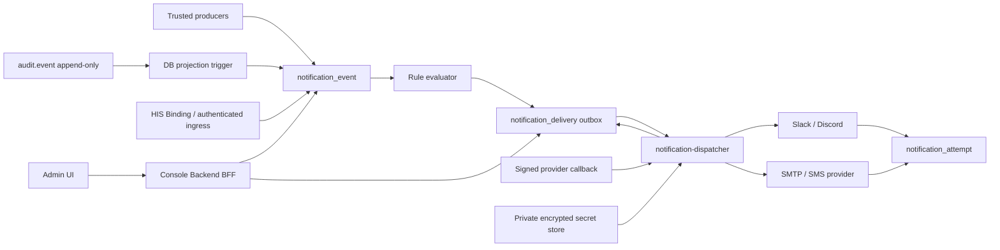

# OpenSphere Console 외부 알림 채널 종합 설계

Status: **설계 제안 · 구현 전 승인 필요**  
Date: **2026-07-23**  
Target: **OpenSphere Console `/manage/notification-channels`**  
Scope: **이메일, SMS, Slack, Discord 및 후속 provider adapter**  
Assumption: 요청의 “다스코드”는 **Discord**를 의미한다고 해석했다.

## 1. 결론

외부 알림은 기존 `/manage/notifications`에 발송 기능을 덧붙이는 방식이 아니라, 별도 관리 화면과 서버 측 전달 엔진으로 구현한다.

핵심 결정은 다음과 같다.

1. 기존 `/manage/notifications`는 **Console 안에서 사람이 확인하는 인박스**로 유지한다.
2. 새 `/manage/notification-channels`는 **채널 연결, 라우팅 규칙, 전달 이력**을 관리하는 관리자 화면으로 만든다.
3. 브라우저나 plugin이 외부 서비스로 직접 전송하지 않는다. 외부 발송은 신뢰된 서버 이벤트만 소비하는 `notification-dispatcher`가 담당한다.
4. `audit.event`의 append-only 성격과 기존 `change_outbox` 패턴을 재사용해 이벤트, 전달, 재시도, 실패 이력을 영속화한다.
5. Slack/Discord webhook URL, SMTP 비밀번호, SMS API secret은 일반 설정 JSON이나 브라우저 응답에 저장·노출하지 않는다.
6. 전달 보장은 **at-least-once**로 정의한다. 중복 억제는 수행하지만 provider 특성상 exactly-once를 약속하지 않는다.
7. Console은 HIS가 소유한 Prometheus/Alertmanager를 설치하거나 설정하지 않는다. HIS alert를 받으려면 별도 읽기 전용 Binding 또는 인증된 event ingress를 사용한다.

권장 1차 범위는 Slack Incoming Webhook, Discord Webhook, SMTP 이메일, SMS provider adapter 1종이다. 임의 URL을 받는 Generic Webhook은 SSRF 위험 때문에 2차로 미룬다.

---

## 2. 현재 구현 검토

### 2.1 확인된 기반

| 영역 | 현재 상태 | 이번 설계에 주는 의미 |
|---|---|---|
| Console UI | Angular 22 + Clarity v18, Carbon 아이콘, `os-*` facade | 새 화면도 동일 컴포넌트와 토큰을 사용한다. |
| 관리 내비게이션 | `/manage/*` 아래 `AdminLayout`의 2단 메뉴 | “운영 및 증거” 그룹에 `외부 채널`을 추가한다. |
| 인앱 알림 | `/manage/notifications`, 헤더 벨, `NotificationService` | 외부 발송 설정과 분리하되 같은 이벤트 명명 규칙을 공유한다. |
| 감사 권위 | Supabase `audit.event`, update/delete 차단 | 설정 변경과 전달 재시도도 감사 이벤트로 남긴다. |
| 비동기 작업 | `console.change_outbox`의 queued/dispatching/completed/failed/dead-letter | 전달 큐와 재시도 상태 모델의 선행 패턴으로 사용한다. |
| 인증/권한 | Console Backend가 세션과 관리자 역할을 검증 | 모든 읽기/변경 API를 Backend 권한으로 보호한다. |
| Observability 경계 | HIS가 Prometheus/Grafana/Alertmanager 수명주기 소유 | Console이 Alertmanager receiver를 대신 관리하지 않는다. |
| Status plugin | notification contribution이 비활성 | 현재 status plugin이 외부 전파 이벤트를 제공한다고 가정하면 안 된다. |

근거:

- [DESIGN-GUIDE.md](../DESIGN-GUIDE.md)
- [admin-layout.ts](../src/app/pages/admin-layout.ts)
- [admin-notifications.ts](../src/app/pages/admin-notifications.ts)
- [notification.service.ts](../src/app/core/notification.service.ts)
- [0001_console_backbone.sql](../backend/supabase/migrations/0001_console_backbone.sql)
- [0009_platform_control_governance.sql](../backend/supabase/migrations/0009_platform_control_governance.sql)
- [PLAN-CONSOLE-PLATFORM-CONTROL-PLANE-V2-2026-07-22.md](PLAN-CONSOLE-PLATFORM-CONTROL-PLANE-V2-2026-07-22.md)
- [OpenSphere-plugin-status manifest](../../OpenSphere-plugin-status/ui-shell/ui-shell.manifest.json)

### 2.2 기존 인앱 알림을 발송 엔진으로 직접 사용할 수 없는 이유

현재 `NotificationService`는 다음 책임에 적합하다.

- Console audit polling 결과와 in-process `ctx.notify` 이벤트 병합
- 브라우저 내 읽음 상태와 토스트 처리
- 헤더 벨 및 `/manage/notifications` 목록 제공

외부 발송 엔진에는 부족한 점이 있다.

- 읽음 상태가 브라우저 `localStorage`에 보관된다.
- in-process 이벤트는 새로고침·프로세스 종료 후 전달 보장을 하지 못한다.
- provider 응답, 재시도 횟수, dead-letter, callback receipt가 없다.
- 브라우저 이벤트를 외부 발송 입력으로 허용하면 신뢰 경계가 약해진다.
- 한 사용자의 브라우저가 꺼져 있어도 운영 알림은 계속 전달되어야 한다.

따라서 UI 모델은 재사용하되, 외부 전파 입력은 반드시 서버 영속 이벤트여야 한다.

현재 인앱 모델의 severity는 `info/success/warning/error`다. 새 외부 전달 모델에서 `critical`을 추가하려면 기존 값을 조용히 재해석하지 않고, trusted producer 정책 또는 명시적 rule로만 승격한다. `audit.event`의 `failed` projection 기본값은 `error`다.

---

## 3. 목표와 비목표

### 3.1 목표

- 관리자가 외부 채널을 연결·테스트·비활성화·자격 증명 교체할 수 있다.
- 이벤트의 source/category/severity/label에 따라 여러 채널로 라우팅할 수 있다.
- 조용한 시간, 중복 억제, 속도 제한, critical 우회 정책을 설정할 수 있다.
- 이벤트별 전달 상태와 모든 시도를 추적하고 실패 건을 안전하게 재시도할 수 있다.
- secret, 개인정보, provider 오류를 노출하지 않으면서 운영 진단에 충분한 증거를 남긴다.
- 새 provider를 Console 화면 전체 수정 없이 adapter로 추가할 수 있다.

### 3.2 비목표

- Alertmanager 설치, receiver 구성, retention 운영
- Slack/Discord에서의 양방향 명령 처리
- 마케팅 메일·광고 문자 캠페인
- 사용자별 개인 알림 선호 설정
- 외부 채널에서 Console 변경 작업 승인
- 읽음 여부의 보편적 보장
- exactly-once 전달 보장

양방향 승인과 작업 실행은 webhook URL 유출·replay·권한 상승 위험이 크므로 별도 보안 설계 없이 포함하지 않는다.

---

## 4. 사용자와 핵심 시나리오

| 사용자 | 필요 작업 | 필요한 권한 |
|---|---|---|
| Console 관리자 | 채널 연결, secret 교체, 규칙 변경, 전역 중지 | `notification.channels.write`, `notification.rules.write`, AAL2 |
| Console 운영자 | 상태 확인, 테스트, 실패 재시도, 전달 이력 조회 | read + `notification.deliveries.retry` |
| Console 조회자 | 연결 상태와 마스킹된 이력 조회 | `notification.channels.read` |
| Dispatcher service | 이벤트 claim, provider 전송, attempt 기록 | 별도 DB role과 secret decrypt 권한 |
| Trusted producer | 정규화 이벤트 발행 | 전용 service identity, browser credential 금지 |

대표 시나리오:

1. 관리자가 Slack webhook을 등록하고 테스트 메시지를 보낸 뒤 활성화한다.
2. `error` 이상이고 source가 `platform-control`인 이벤트를 Slack과 SMS로 전송한다.
3. 같은 장애가 반복되면 10분 동안 묶고, occurrence count만 갱신한다.
4. Slack이 429를 반환하면 `Retry-After`에 맞춰 재시도한다.
5. SMS provider callback이 `delivered` 또는 `undelivered`를 알려오면 전달 상태를 갱신한다.
6. secret을 교체해도 과거 전달 이력에는 secret이 남지 않는다.
7. 채널 장애가 길어지면 circuit을 열고 dead-letter 건수를 화면에 표시한다.

---

## 5. 정보 구조와 내비게이션

### 5.1 권장 경로

- 경로: `/manage/notification-channels`
- 메뉴 그룹: `운영 및 증거`
- 메뉴 순서: `알림` → `외부 채널` → `감사 로그`
- 메뉴 아이콘: Carbon `connect` 또는 `send-alt`; 제품 로고 대용으로 사용하지 않는다.

기존 인박스와 새 화면의 책임은 다음처럼 구분한다.

| 화면 | 질문 | 주 사용자 |
|---|---|---|
| `/manage/notifications` | “Console에서 지금 확인할 알림은 무엇인가?” | 모든 Console 사용자 |
| `/manage/notification-channels` | “어떤 이벤트를 어디로 보내며 실제로 전달됐는가?” | 관리자·운영자 |

### 5.2 탭 구조

Clarity Tabs로 한 route 안에서 다음 세 탭을 제공한다.

1. **채널** — 연결과 건강 상태
2. **라우팅 규칙** — 어떤 이벤트를 어디로 보낼지 결정
3. **전달 이력** — 이벤트별 전송·재시도·실패 증거

템플릿은 1차에서는 채널 편집 패널의 “메시지 형식” 단계에 둔다. 공용 템플릿 카탈로그가 실제로 필요해질 때 별도 탭으로 승격한다.

---

## 6. 페이지 디자인 명세

### 6.1 공통 상단 영역

| 영역 | 내용 | 구현 |
|---|---|---|
| Page header | 제목 `외부 채널`, tag `Core·Admin · Outbound delivery` | `os-page-header` |
| 설명 | “Console 이벤트를 이메일, 문자, Slack, Discord 등으로 안전하게 전달합니다.” | 기존 `manage-page-lead` |
| Primary action | `채널 연결` | `btn btn-primary` |
| Secondary action | `새로고침` | `btn btn-outline` |
| Emergency action | `전체 발송 일시중지` | overflow 안에 배치, `clr-modal` 확인 + 사유 + AAL2 |

상태 레일은 기존 관리 화면의 시각 규율을 유지한다.

| 카드 | 계산 | 상태 표현 |
|---|---|---|
| Active | 활성 채널 수 | 기본 |
| Healthy | 최근 test/전송이 정상인 채널 수 | success |
| Degraded | 최근 연속 실패 또는 circuit open 채널 수 | warning |
| Failed 24h | 최근 24시간 최종 실패 건수 | danger |
| Dead letter | 수동 조치 필요 건수 | danger |

통계는 화면에서 임의 계산하지 않고 서버 summary API 결과를 사용한다.

### 6.2 채널 탭

#### 목록

`clr-datagrid` 열:

| 열 | 표시 내용 |
|---|---|
| 유형 | 이메일 / SMS / Slack / Discord |
| 이름·대상 | 운영 Slack, `#platform-alerts`; 이메일·전화번호는 마스킹 |
| 상태 | Draft / Healthy / Degraded / Disabled / Misconfigured |
| 규칙 | 연결된 활성 규칙 수 |
| 최근 성공 | provider가 확인한 마지막 수락 또는 배달 시각 |
| 최근 테스트 | 성공/실패와 시각 |
| 활성 | 현재 발송 가능 여부 |
| 작업 | 테스트, 편집, secret 교체, 비활성화, 삭제 |

행을 열면 `os-panel` 상세를 사용한다. 상세에는 다음만 표시한다.

- non-secret 설정
- 마스킹된 대상
- 최근 health 결과
- 최근 5개 전달
- 연결된 규칙
- 생성/수정자와 사유

secret 원문, webhook 전체 URL, SMTP password, SMS auth token은 표시하지 않는다.

#### 채널 연결 패널

`os-panel` 안에 Clarity Stepper와 Clarity Form을 사용한다.

1. **유형 선택**
   - 이메일, SMS, Slack, Discord
   - provider 이름은 텍스트로 표시한다.
   - 로고를 쓰려면 OpenSphere Logos resolver에서 해당 shortname·variant를 먼저 검증한다.
2. **연결 정보**
   - provider별 필드와 secret 입력
   - secret은 password input이며 저장 후 다시 반환하지 않는다.
3. **대상·형식**
   - 채널/수신자, 제목 prefix, locale, 본문 preview
   - preview에는 실제 secret과 민감한 event field를 넣지 않는다.
4. **테스트 및 활성화**
   - `테스트 전송` 후 결과 확인
   - 성공한 draft만 활성화 가능
   - “테스트 성공”은 실제 운영 이벤트 전달과 구분해 저장한다.

provider별 입력:

| 유형 | 필수 입력 | 비고 |
|---|---|---|
| Slack | Incoming Webhook URL, 표시 이름 | URL에 secret이 포함되므로 전체 secret 취급 |
| Discord | Webhook URL, 선택 thread ID | `wait=true`, `allowed_mentions.parse=[]` 기본 |
| 이메일 | SMTP host/port, TLS mode, username/password, from, recipients | 수신자는 고정 allowlist; 동적 event 수신자 금지 |
| SMS | provider, account ID, API secret, sender/messaging service, recipients | callback URL과 서명 검증 상태 표시 |

secret 변경은 편집이 아니라 `자격 증명 교체` 동작으로 표현한다. 현재 값을 채운 것처럼 보이는 가짜 placeholder는 사용하지 않는다.

#### 삭제 규칙

- 활성 규칙이 참조하는 채널은 바로 삭제할 수 없다.
- 먼저 비활성화하거나 규칙에서 제거해야 한다.
- 삭제 확인에는 채널 이름과 8자 이상 사유가 필요하다.
- metadata는 soft-delete하고 delivery/attempt 이력은 retention 기간 동안 유지한다.

### 6.3 라우팅 규칙 탭

`clr-datagrid` 열:

| 열 | 표시 내용 |
|---|---|
| 우선순위 | 작은 숫자부터 평가 |
| 이름 | 예: `Platform critical` |
| 조건 | severity, source, category, labels 요약 |
| 대상 채널 | 채널 label 목록 |
| 시간 정책 | 항상 / quiet hours / maintenance silence |
| 중복·속도 제한 | 예: 10분 dedup, 채널당 분당 30건 |
| 최근 일치 | 마지막 matched 시각 |
| 상태 | Active / Disabled / Invalid |

규칙 편집 패널 필드:

- 이름, 설명, 활성 여부, 우선순위
- severity 최소값: info / success / warning / error / critical
- source 다중 선택
- category 다중 선택
- label exact-match 조건
- 대상 채널 다중 선택
- quiet hours와 timezone
- critical의 quiet-hours 우회 여부
- dedup window
- throttle limit와 burst
- 제목·본문에 포함할 안전 필드
- 샘플 event를 이용한 match 결과와 메시지 preview

평가 규칙은 단순하고 재현 가능하게 한다.

1. 활성 규칙을 priority 순으로 평가한다.
2. 모든 조건은 AND, 다중 선택 값 내부는 OR이다.
3. 일치한 모든 규칙의 대상 채널을 합집합으로 만든다.
4. 동일 event/channel 조합은 한 번만 delivery를 만든다.
5. 평가 당시 rule version과 policy snapshot을 delivery에 저장한다.
6. 규칙 미일치 event는 `unrouted` metric만 증가시키고 실패로 보지 않는다.

초기 버전에는 임의 표현식, 정규식, 사용자 작성 script를 넣지 않는다. 복잡한 조건 언어는 검증·보안·설명 가능성을 크게 낮춘다.

### 6.4 전달 이력 탭

서버 페이지네이션을 사용하는 `clr-datagrid`로 구현한다.

필터:

- 기간
- 전달 상태
- 채널
- provider
- severity
- source/category
- event ID / request ID / correlation ID 검색

열:

| 열 | 표시 내용 |
|---|---|
| 이벤트 | severity, title, source |
| 채널 | 이름과 provider |
| 상태 | Queued / Sending / Accepted / Delivered / Retrying / Failed / Dead letter / Suppressed |
| 시도 | 현재 횟수 / 최대 횟수 |
| provider 결과 | 마스킹한 code와 request/message ID |
| 지연 | event 발생부터 최종 상태까지 |
| 최근 시각 | 마지막 상태 변경 |

행 상세 `os-panel`:

- 정규화 event 요약
- 적용된 rule과 version
- 렌더된 메시지의 민감정보 제거 preview
- attempt timeline
- HTTP status 또는 SMTP/provider result의 허용된 요약
- 다음 retry 시각
- request/correlation/provider message ID
- `관련 알림 보기`, `감사 로그 보기`

실패 건의 `재시도`는 새 delivery를 만들지 않고 기존 delivery의 retry generation을 증가시킨다. 작업자는 사유를 입력해야 하며, 이미 Accepted/Delivered인 건은 재시도할 수 없다.

### 6.5 상태, 오류, 빈 화면

| 상태 | 화면 처리 |
|---|---|
| Loading | Clarity spinner + table skeleton 수준의 최소 표시 |
| No channels | 채널 연결 목적과 `채널 연결` CTA |
| No rules | 채널은 있어도 아무 이벤트도 전송되지 않음을 명시 |
| No deliveries | 필터 범위에 전달 이력이 없음을 명시 |
| Forbidden | 필요한 permission을 표시, 설정 존재 여부는 과도하게 노출하지 않음 |
| Backend unavailable | 빈 목록으로 위장하지 않고 `clr-alert danger` |
| Dispatcher degraded | 상단 rail + persistent warning alert |
| Secret unavailable | 채널을 Misconfigured로 전환, 발송 차단 |
| Global pause | 페이지 전체에 warning banner와 시작자·사유·시각 표시 |

### 6.6 접근성과 반응형

- 상태는 색상만으로 표현하지 않고 badge text를 함께 표시한다.
- 모든 icon-only button에 `aria-label`을 제공한다.
- side panel과 modal의 focus/ESC/backdrop은 Clarity에 위임한다.
- 200% zoom에서도 Primary action, 탭, 행 작업, panel close에 접근 가능해야 한다.
- 좁은 화면에서는 상태 레일을 2열/1열로 wrap하고 datagrid는 수평 스크롤보다 열 우선순위 축소를 먼저 적용한다.
- secret field의 오류 메시지는 field와 프로그램적으로 연결한다.
- test 결과는 `aria-live=polite`, 실제 장애/저장 실패는 `clr-alert`로 제공한다.

---

## 7. 채널별 전달 계약

### 7.1 공통 상태 의미

provider가 반환할 수 있는 증거 수준이 다르므로 UI가 모든 성공을 “배달 완료”라고 표시하면 안 된다.

| 내부 상태 | 의미 |
|---|---|
| Accepted | provider가 요청을 수락했으나 최종 단말 배달은 확인되지 않음 |
| Delivered | provider callback 등으로 목적지 배달을 확인 |
| Posted | chat provider가 생성된 message를 반환 |
| Failed | 인증·형식·폐기된 endpoint처럼 자동 재시도할 수 없는 영구 실패 |
| Dead letter | 일시 오류였지만 자동 재시도 횟수 또는 TTL을 소진한 실패 |

UI 공통 badge는 `Accepted`와 `Delivered`를 구분한다.

### 7.2 Slack

- 1차는 Incoming Webhook을 사용한다.
- webhook URL은 채널에 연결된 secret이다.
- Block Kit payload와 plain text fallback을 함께 만든다.
- 429에서는 `Retry-After`를 우선한다.
- invalid token, disabled hook, archived channel 등 영구 오류는 즉시 Misconfigured로 분류한다.
- webhook 전송 후 삭제를 보장하지 못하므로 민감정보를 보내지 않는다.
- 기본 속도 제한은 채널별 1 request/second 이하로 둔다.

### 7.3 Discord

- Execute Webhook을 사용하고 `wait=true`로 생성 결과를 받는다.
- `allowed_mentions: { parse: [] }`를 기본으로 강제해 event text가 `@everyone`, role, user ping을 만들지 못하게 한다.
- content/embeds 길이 제한 전에 server-side truncate와 link-back을 적용한다.
- 응답의 rate-limit bucket과 `Retry-After`를 동적으로 따른다. 고정 한도를 코드에 박지 않는다.
- 404 webhook은 자동 재시도하지 않고 채널을 Misconfigured로 전환한다.

### 7.4 이메일

- 1차는 SMTP submission adapter를 제공한다.
- STARTTLS/TLS 필수, 인증서 검증 우회 옵션은 제공하지 않는다.
- SMTP `250 accepted`는 mailbox 최종 배달이 아니라 Accepted로 기록한다.
- 제목·텍스트·HTML multipart를 제공하되 HTML은 server-owned template만 사용한다.
- From domain의 SPF/DKIM/DMARC 준비는 운영 preflight로 검증한다.
- 수신자는 저장 시 검증하고 화면·로그에서는 마스킹한다.
- provider API adapter를 추가할 때 message ID와 bounce/delivery callback을 연결한다.

### 7.5 SMS

- core가 특정 사업자에 종속되지 않도록 adapter interface로 만든다.
- 첫 adapter 후보는 Twilio 또는 국내 사업자 중 실제 운영 계약이 있는 하나를 선택한다.
- E.164로 정규화하되 provider/국가별 sender ID 규정을 별도로 검증한다.
- provider message ID를 저장하고 delivery status callback을 검증해 상태를 갱신한다.
- callback은 provider 공식 SDK의 signature validation을 사용한다.
- 메시지는 짧은 요약, severity, 발생 시각, 인증이 필요한 Console deep link만 포함한다.
- 민감 상세, secret, access token, 고객 데이터는 SMS 본문에 넣지 않는다.
- 광고성 정보 발송은 이번 기능 범위에서 금지하고, 운영·보안 알림만 허용한다.

### 7.6 후속 adapter

권장 순서:

1. Microsoft Teams webhook/workflow
2. Generic signed webhook
3. 국내 SMS 사업자
4. PagerDuty/Opsgenie 계열 incident provider

Generic Webhook은 URL allowlist, DNS 재검증, private/link-local/metadata IP 차단, redirect 차단, egress proxy를 갖춘 뒤에만 추가한다.

---

## 8. 목표 아키텍처



### 8.1 컴포넌트 책임

| 컴포넌트 | 책임 | 하지 않는 일 |
|---|---|---|
| Angular Admin UI | 설정·상태·이력 표시, 입력 검증 | 외부 발송, secret 보관 |
| Console Backend | 사용자 인증/권한, CRUD BFF, 감사 기록 | 장시간 retry worker 역할 |
| notification-dispatcher | rule 평가, queue claim, adapter 실행, retry/circuit/callback | browser session 처리 |
| Supabase/PostgreSQL | metadata, event, delivery, attempt, audit 영속화 | raw secret 일반 조회 |
| private secret store | 암호화 credential과 key version | UI 응답 제공 |
| HIS adapter | 허용된 alert event를 정규화 | Alertmanager 수명주기 관리 |

### 8.2 이벤트 입력 원칙

외부 전송 대상은 아래 둘 중 하나만 허용한다.

1. `audit.event`에서 transactionally projection된 이벤트
2. 인증된 server-to-server producer가 제출한 정규화 이벤트

브라우저 `ctx.notify`, localStorage 상태, 임의 plugin DOM event는 직접 입력으로 허용하지 않는다. plugin이 외부 전파 가능한 이벤트를 발행하려면 backend contribution과 service identity가 필요하다.

정규화 event 예시:

```json
{
  "sourceType": "audit",
  "sourceId": "9a98d59c-...",
  "source": "platform-control",
  "category": "change",
  "severity": "error",
  "title": "플랫폼 변경 적용 실패",
  "body": "승인된 변경이 적용 단계에서 실패했습니다.",
  "route": "/manage/change-control?requestId=...",
  "occurredAt": "2026-07-23T09:00:00Z",
  "labels": {
    "phase": "failed",
    "targetType": "declarative-change"
  },
  "correlationId": "...",
  "payloadDigest": "sha256:..."
}
```

`title`, `body`, `route`, label key/value에는 길이 제한과 allowlist를 적용한다. 임의 HTML은 받지 않는다.

### 8.3 전달 처리

1. event insert 시 활성 rule을 평가한다.
2. event/channel별 delivery row를 `queued`로 만든다.
3. dispatcher가 `FOR UPDATE SKIP LOCKED`로 claim한다.
4. provider adapter가 payload를 렌더하고 전송한다.
5. attempt를 append하고 delivery 상태를 갱신한다.
6. retryable error는 다음 시각을 계산한다.
7. 최대 시도 또는 TTL 초과 시 dead-letter로 전환한다.
8. provider callback이 오면 서명과 provider message ID를 검증하고 최종 상태를 갱신한다.

### 8.4 재시도 기본값

| 항목 | 권장 기본값 |
|---|---|
| 네트워크/5xx | exponential backoff + full jitter |
| 429 | provider `Retry-After` 우선 |
| 4xx malformed/auth/revoked | 자동 재시도 없음, Misconfigured |
| 최대 자동 시도 | 8회 |
| 최대 retry TTL | error/critical 24시간, 그 외 6시간 |
| request timeout | connect 3초, 전체 10초; provider별 상한 |
| dedup | event/channel unique + rule dedup window |
| circuit open | 최근 연속 실패 임계치 초과 시 5분, 점진 확대 |

provider가 idempotency key를 지원하면 delivery ID를 사용한다. 지원하지 않는 webhook은 timeout 직후 성공 여부를 알 수 없어 중복 가능성이 있음을 attempt에 기록한다.

---

## 9. 데이터 모델

권장 migration: `backend/supabase/migrations/0011_notification_delivery.sql`

### 9.1 테이블

#### `console.notification_channel`

| 필드 | 의미 |
|---|---|
| `id uuid` | 채널 ID |
| `name text` | 운영 표시 이름 |
| `provider text` | slack, discord, smtp, twilio 등 |
| `channel_type text` | chat, email, sms |
| `enabled boolean` | 라우팅 가능 여부 |
| `health_state text` | Draft/Healthy/Degraded/Disabled/Misconfigured |
| `config jsonb` | secret이 아닌 provider 설정 |
| `secret_ref uuid` | private secret row 참조; browser select 금지 |
| `secret_version integer` | 교체 추적 |
| `last_test_*` | 최근 test 상태·시각·오류 코드 |
| `last_success_at` | 최근 provider 수락/배달 시각 |
| `created_by/updated_by` | Console subject |
| `created_at/updated_at/deleted_at` | 수명주기 |

#### `console.notification_rule`

| 필드 | 의미 |
|---|---|
| `id`, `name`, `description` | 식별 |
| `enabled`, `priority`, `version` | 평가 순서와 snapshot |
| `min_severity` | 최소 심각도 |
| `sources`, `categories` | allowlist 배열 |
| `label_match jsonb` | exact match 조건 |
| `quiet_hours jsonb` | timezone 포함 |
| `dedup_window_seconds` | 반복 억제 |
| `throttle jsonb` | limit/burst |
| `message_policy jsonb` | 포함 가능한 안전 필드 |
| `created_by/updated_by`, timestamps | 감사 보조 정보 |

#### `console.notification_rule_channel`

rule과 channel의 N:M 연결 테이블이다. `rule_id`, `channel_id`를 외래키로 두고 복합 primary key를 사용한다. API에서는 편의를 위해 `channelIds` 배열로 주고받되 DB에는 배열 FK 대신 정규화해 삭제·비활성화 검증과 참조 무결성을 보장한다.

#### `console.notification_event`

| 필드 | 의미 |
|---|---|
| `id uuid` | event ID |
| `source_type`, `source_id` | 원본 종류·ID, unique |
| `source`, `category`, `severity` | 라우팅 필드 |
| `title`, `body`, `route` | 안전한 표시 필드 |
| `labels jsonb` | allowlist metadata |
| `request_id`, `correlation_id` | 기존 감사 연결 |
| `payload_digest` | 원문 무결성 연결 |
| `occurred_at`, `ingested_at`, `expires_at` | 시간 |

#### `console.notification_delivery`

| 필드 | 의미 |
|---|---|
| `id`, `event_id`, `channel_id` | 전달 식별 |
| `rule_ids`, `policy_snapshot` | 결정 재현 |
| `status` | queued/sending/accepted/delivered/retrying/failed/dead-letter/suppressed |
| `attempt_count`, `next_attempt_at`, `locked_at`, `lock_owner` | worker claim |
| `provider_message_id` | callback correlation |
| `last_error_class/code` | secret 제거 오류 |
| `accepted_at/delivered_at/completed_at` | 상태 시각 |
| `retry_generation` | 수동 재시도 세대 |

제약: `UNIQUE(event_id, channel_id)`.

#### `console.notification_attempt`

append-only 시도 ledger다.

- delivery ID, attempt number, worker ID
- started/completed time, latency
- outcome, HTTP/SMTP/provider status
- provider request ID
- retry-after
- sanitized error class/code/message
- request/response digest

원문 payload, Authorization header, webhook URL은 저장하지 않는다.

#### `console.notification_callback_receipt`

provider callback의 replay와 중복 처리를 막는 append-only receipt다.

- provider, provider event/delivery ID, provider message ID
- signature valid 여부와 disposition
- raw body digest
- 연결된 delivery ID와 정규화 상태
- received/processed 시각과 오류 코드

`UNIQUE(provider, provider_event_id)` 또는 provider가 event ID를 주지 않는 경우 검증된 대체 idempotency key를 사용한다.

#### `console.notification_delivery_control`

single-row 제어 상태로 global pause 여부, 시작자, 사유, 시작 시각을 저장한다. pause 중 event는 폐기하지 않고 `queued` 또는 명시적 `suppressed` 정책으로 보존하며, 재개 동작의 처리 범위를 운영자가 확인할 수 있게 한다.

#### `notification_private.channel_secret`

PostgREST 노출 schema 밖에 둔다.

- `id`, provider, key version
- envelope-encrypted ciphertext
- nonce/algorithm metadata
- created/rotated/revoked timestamps

Dispatcher 전용 DB role만 decrypt 가능한 row를 읽는다. Console browser role과 일반 Backend read API에는 grant하지 않는다.

### 9.2 RLS와 권한

- browser `authenticated` role은 위 테이블을 직접 읽거나 변경하지 않는다.
- Console Backend DB role은 channel/rule/event/delivery의 필요한 metadata에만 접근한다.
- Dispatcher DB role은 queue claim, attempt insert, delivery update, secret read/decrypt만 허용한다.
- attempt와 audit event는 update/delete를 차단한다.
- delivery의 상태 전이는 DB function으로 제한한다.

### 9.3 보존 기본안

| 데이터 | 기본 보존 |
|---|---|
| 채널·규칙 변경 이력 | 감사 정책과 동일 |
| delivery metadata | 180일 |
| rendered preview | 30일 또는 미저장 |
| attempt metadata | 180일 |
| secret revoked version | 30일 후 ciphertext 폐기, metadata 유지 |
| 원본 audit event | 기존 감사 정책 준수 |

실제 ISMS/고객 계약과 저장 용량을 확인한 뒤 운영값을 확정한다.

---

## 10. API 설계

Base path: `/api/notifications`

### 10.1 UI용 API

| Method | Path | 권한 | 용도 |
|---|---|---|---|
| GET | `/summary` | read | 상태 레일 |
| GET | `/channels` | read | 채널 목록 |
| POST | `/channels` | channels.write + AAL2 | draft 생성과 secret 저장 |
| GET | `/channels/:id` | read | 상세 |
| PATCH | `/channels/:id` | channels.write | non-secret 설정 변경 |
| POST | `/channels/:id/credentials` | channels.write + AAL2 | secret 교체 |
| POST | `/channels/:id/test` | channels.write | test delivery 생성 |
| POST | `/channels/:id/enable` | channels.write | 활성화 |
| POST | `/channels/:id/disable` | channels.write | 비활성화 |
| DELETE | `/channels/:id` | channels.write + AAL2 | soft-delete |
| GET | `/rules` | read | 규칙 목록 |
| POST | `/rules` | rules.write | 규칙 생성 |
| PATCH | `/rules/:id` | rules.write | version 증가 변경 |
| DELETE | `/rules/:id` | rules.write | 비활성/삭제 |
| POST | `/rules/preview` | rules.write | sample match·render preview |
| GET | `/deliveries` | read | server-side filter/page |
| GET | `/deliveries/:id` | read | attempt timeline |
| POST | `/deliveries/:id/retry` | deliveries.retry | 수동 재시도 |
| POST | `/pause` | global.pause + AAL2 | 전체 일시중지 |
| DELETE | `/pause` | global.pause + AAL2 | 재개 |

모든 mutation body에는 `reason`을 요구한다. API는 secret 원문을 반환하지 않고 다음 형태만 반환한다.

```json
{
  "credential": {
    "configured": true,
    "version": 3,
    "rotatedAt": "2026-07-23T09:00:00Z"
  }
}
```

### 10.2 내부 event ingress

`POST /api/internal/notifications/events`

- browser JWT 거부
- Kubernetes projected ServiceAccount token 검증 또는 mTLS/service OIDC 사용
- producer allowlist와 source 강제 태깅
- `Idempotency-Key` 또는 `sourceType + sourceId` unique
- body 64 KiB 이하
- schema validation 실패는 4xx, 영속화 후 202
- producer가 severity/source를 임의 승격하지 못하도록 identity별 policy 적용

현재 정적 shared token 방식은 migration bridge로만 허용하고 최종 계약으로 삼지 않는다.

### 10.3 provider callback

예: `POST /api/notifications/providers/twilio/status`

- browser 인증을 사용하지 않는다.
- provider signature, 정확한 public URL, raw body를 검증한다.
- provider message ID가 기존 delivery와 일치해야 한다.
- callback delivery ID/상태 조합을 idempotent하게 처리한다.
- 원문은 장기 저장하지 않고 digest와 검증 결과만 receipt로 남긴다.
- 유효하지 않은 callback은 401/403과 보안 metric, rate limit을 적용한다.

---

## 11. Provider adapter 계약

```ts
interface NotificationAdapter {
  provider: string;
  validateConfig(config: unknown): ValidationResult;
  test(context: TestContext): Promise<ProviderResult>;
  send(context: DeliveryContext): Promise<ProviderResult>;
  classify(errorOrResponse: unknown):
    | { kind: 'accepted' | 'delivered'; providerMessageId?: string }
    | { kind: 'retryable'; retryAfterMs?: number; code: string }
    | { kind: 'permanent'; code: string };
  verifyCallback?(request: RawCallbackRequest): VerifiedCallback;
}
```

adapter 원칙:

- core delivery state machine을 provider 코드가 직접 변경하지 않는다.
- 반환 오류는 stable class/code로 정규화한다.
- request/response log에 secret이나 본문 전체를 남기지 않는다.
- preview renderer와 실제 renderer가 같은 template function을 사용한다.
- 모든 outbound request에 delivery ID 기반 correlation header를 넣되 provider가 허용하는 경우에만 사용한다.
- redirect는 기본 비활성화한다.

---

## 12. 보안 설계

### 12.1 Secret

- webhook URL 전체를 secret으로 취급한다.
- DB에는 envelope encryption한 ciphertext만 저장한다.
- KEK는 Kubernetes Secret 또는 외부 secret manager에서 dispatcher에만 mount한다.
- production에서는 KMS/Vault 계열 key provider를 우선한다.
- key version을 저장하고 무중단 rotation을 지원한다.
- 화면, audit reason, provider error, trace attribute에 secret을 기록하지 않는다.
- Kubernetes Secret을 사용할 경우 etcd encryption at rest와 최소 RBAC가 선행되어야 한다.

### 12.2 SSRF와 egress

- Slack은 `hooks.slack.com`과 승인된 GovSlack domain만 허용한다.
- Discord는 공식 webhook host/path 형식을 허용한다.
- SMTP host와 SMS API host는 관리자 allowlist 또는 배포 설정으로 제한한다.
- URL의 userinfo, non-HTTPS, IP literal, localhost, private/link-local/metadata range를 차단한다.
- DNS resolve 결과를 연결 직전 재검증한다.
- redirect를 따르지 않는다.
- egress NetworkPolicy 또는 egress proxy에서 destination을 다시 제한한다.
- Generic Webhook은 위 통제가 준비되기 전 비활성화한다.

### 12.3 Content injection과 정보 노출

- user/event 문자열은 provider renderer에서 escape한다.
- Discord mention은 기본 전면 억제한다.
- Slack mrkdwn의 link/mention formatting을 안전하게 처리한다.
- 이메일 HTML은 사용자 입력 HTML을 렌더하지 않는다.
- deep link에는 session/token을 넣지 않고 로그인 후 route만 연다.
- actor email, 전화번호, 고객 이름, raw error stack은 기본 template에서 제외한다.
- rule preview에 “외부로 전송되는 필드”를 명시한다.

### 12.4 권한과 감사

권장 permission:

- `notification.channels.read`
- `notification.channels.write`
- `notification.rules.write`
- `notification.deliveries.retry`
- `notification.global.pause`

다음 동작은 append-only audit에 남긴다.

- channel create/update/enable/disable/delete
- credential create/rotate/revoke — secret 값이 아닌 version과 digest만
- test delivery
- rule create/update/delete
- manual retry
- global pause/resume
- callback signature reject
- repeated provider auth failure와 circuit open

secret 변경, 삭제, global pause는 AAL2를 요구한다. 변경 요청에는 8자 이상 reason과 request/correlation ID를 부여한다.

---

## 13. 운영성, 관측성과 SLO

### 13.1 Dispatcher metrics

- `opensphere_notification_events_total{source,severity}`
- `opensphere_notification_deliveries_total{provider,status}`
- `opensphere_notification_delivery_latency_seconds{provider}` histogram
- `opensphere_notification_retry_total{provider,error_class}`
- `opensphere_notification_dead_letter_total{provider}`
- `opensphere_notification_queue_depth{provider}`
- `opensphere_notification_oldest_queued_seconds`
- `opensphere_notification_circuit_state{provider,channel}`
- `opensphere_notification_callback_invalid_total{provider}`
- `opensphere_notification_unrouted_total{source,severity}`

channel ID, recipient, webhook URL은 metric label로 사용하지 않는다. cardinality와 정보 노출을 함께 막는다.

### 13.2 제안 SLO

| SLI | 1차 목표 |
|---|---|
| error/critical event queueing | p99 5초 이내 |
| healthy provider 첫 시도 시작 | p95 30초 이내 |
| dispatcher availability | 월 99.9% |
| queue 내구성 | process restart 시 손실 0 |
| callback validation | 유효 signature 100%, invalid update 0 |

provider 자체 장애는 OpenSphere delivery availability와 분리해 표시한다.

### 13.3 Health

- liveness: process/event loop
- readiness: DB, secret decrypt key, queue claim 가능 여부
- provider health: 실제 test/최근 전송 기반이며 dispatcher readiness와 분리
- `/metrics`는 HIS가 scrape할 수 있도록 기존 Console observability 계약을 따른다.

외부 채널 엔진 자신의 장애를 같은 고장 난 외부 채널로만 알리면 탐지가 끊길 수 있다. 최소한 Console 상태 레일, HIS metric/alert, dead-letter runbook을 독립 경로로 유지한다.

---

## 14. 구현 배치

### 14.1 Frontend

예상 변경:

- `src/app/pages/admin-notification-channels.ts` 신규
- `src/app/core/notification-channels-client.service.ts` 신규
- `src/app/app.routes.ts` route 추가
- `src/app/pages/admin-layout.ts` 메뉴 추가
- 공통 스타일은 기존 `manage-*`와 Clarity를 우선 사용
- 새 시각 primitive나 디자인 token 추가 없음

권장 Carbon 아이콘:

- 메뉴: `connect/16` 또는 `send-alt/16`
- 상태 보조: `checkmark-filled`, `warning-alt-filled`, `error-filled`
- provider 제품 로고로 사용하지 않는다.

### 14.2 Console Backend

예상 변경:

- `backend/opensphere-console-backend/server.js`에 BFF API와 permission gate 추가
- summary/channel/rule/delivery query 함수 분리
- mutation별 `logAudit` 호출
- pagination/filter 입력 allowlist
- secret input을 dispatcher internal endpoint로 전달하고 응답에서 즉시 폐기

현재 `server.js`가 이미 큰 단일 파일이므로 이번 기능을 그대로 계속 누적하지 않는 것이 좋다. 구현 시작 시 `notification-routes.js`, `notification-repository.js` 정도로 분리하되 광범위한 프레임워크 교체는 하지 않는다.

### 14.3 Dispatcher

신규 디렉터리 제안:

```text
backend/notification-dispatcher/
  server.js
  worker.js
  state-machine.js
  repository.js
  crypto.js
  adapters/
    slack.js
    discord.js
    smtp.js
    sms.js
  renderers/
  test/
  Dockerfile
  deploy.yaml
  network-policy.yaml
```

worker는 DB-backed queue를 사용한다. Redis/Kafka를 1차 필수 의존성으로 추가하지 않는다. 현재 Supabase가 Console 데이터 권위이고, queue volume도 운영 알림 수준이므로 PostgreSQL outbox로 시작하는 편이 일관성과 복구가 좋다.

### 14.4 배포

- Dispatcher Deployment 최소 2 replicas
- graceful shutdown에서 새 claim 중지 후 진행 중 attempt 종료
- lock timeout으로 죽은 worker claim 회수
- PodDisruptionBudget
- egress NetworkPolicy
- decrypt key mount와 rotation runbook
- callback용 ingress route
- DB migration과 dispatcher 배포 후 UI를 활성화하는 순서

---

## 15. 단계별 구현 계획

### Phase 0 — 계약과 보안 결정

- SMS 첫 provider 선택
- production secret manager/KMS 결정
- 이메일 SMTP relay와 From domain 결정
- 외부 전송 가능 event field allowlist 확정
- retention과 국내 SMS 운영·법무 확인
- permission과 AAL2 정책 승인

Exit criteria:

- provider credential과 callback 계약 문서화
- threat model 승인
- 실제 staging destination 준비

### Phase 1 — 데이터와 Dispatcher 기반

- `0011_notification_delivery.sql`
- channel/rule/event/delivery/attempt/private secret schema
- role/RLS/state transition function
- encrypted secret 저장
- PostgreSQL queue claim/retry/dead-letter
- Slack/Discord adapter
- metrics/readiness

Exit criteria:

- process kill 후 queued delivery 손실 없음
- 동일 event/channel 중복 row 없음
- secret이 DB 일반 select, API, log에 나타나지 않음
- 429/5xx/permanent 4xx 분류 테스트 통과

### Phase 2 — 관리 UI와 BFF

- route/nav/page/tabs
- channel create/test/rotate/disable
- rule CRUD와 preview
- delivery history/detail/retry
- audit/AAL2/permission gate
- global pause

Exit criteria:

- keyboard-only 핵심 흐름 통과
- 200% zoom 핵심 action 접근 가능
- forbidden/degraded/empty/loading/error 상태 검증
- production build와 contract test 통과

### Phase 3 — 이메일·SMS와 callback

- SMTP adapter
- 선정 SMS adapter
- signed status callback receipt
- Accepted와 Delivered 분리
- phone/email masking과 data retention job

Exit criteria:

- invalid callback signature가 상태를 변경하지 못함
- callback replay가 idempotent
- provider message ID로 delivery correlation
- staging 실제 배달 증거 수집

### Phase 4 — 운영 강화

- KMS/external secret store 전환 또는 검증
- key rotation drill
- queue backlog/circuit/dead-letter runbook
- HIS metric binding
- chaos test: DNS, timeout, 429, revoked webhook, DB failover
- Generic Webhook은 SSRF controls 검증 후 별도 승인

---

## 16. 테스트 전략

### 16.1 Unit

- rule matcher: severity/source/category/labels/quiet hours
- union/dedup: 여러 rule이 같은 채널을 선택하는 경우
- renderer escaping, truncation, mention suppression
- error classifier와 retry schedule
- state transition invalid path 거부
- secret redaction

### 16.2 Contract

- Angular client ↔ Backend DTO
- Backend ↔ Supabase RPC/schema
- Dispatcher adapter contract
- provider callback signature fixture
- migration grants/RLS

### 16.3 Integration

- local fake provider 2xx/4xx/5xx/429/timeout
- dispatcher multi-replica `SKIP LOCKED`
- worker crash와 lock recovery
- credential rotation 중 in-flight delivery
- global pause/resume
- deleted/disabled channel과 queued delivery 처리

### 16.4 Browser/접근성

- 채널 연결 4단계
- validation과 test 결과 focus
- datagrid filter/pagination
- side panel focus trap/close
- modal destructive confirmation
- keyboard-only, 200% zoom, screen reader names
- secret이 DOM/API response/history에 남지 않는지 확인

### 16.5 Security

- SSRF bypass corpus
- redirect/DNS rebinding/private IP
- webhook URL log leak 검사
- Discord mention injection
- Slack mrkdwn/link injection
- HTML email sanitization
- callback spoof/replay
- privilege escalation과 missing AAL2
- oversized event/body와 high-cardinality labels

---

## 17. 수용 기준

기능 완료는 아래를 모두 만족할 때로 정의한다.

1. 관리자가 4종 채널을 draft로 만들고 test 후 활성화할 수 있다.
2. secret은 생성·교체 시에만 입력되고 어떤 read API에서도 반환되지 않는다.
3. server-side event만 외부 전달을 만들 수 있다.
4. 같은 event/channel은 하나의 delivery만 가진다.
5. 429는 `Retry-After`, 5xx는 backoff, permanent 4xx는 fail-fast 처리한다.
6. 모든 mutation과 manual retry가 append-only audit에 기록된다.
7. Accepted와 Delivered를 구분하고 unsupported read receipt를 가장하지 않는다.
8. dispatcher restart와 replica 경쟁에서도 delivery가 유실되지 않는다.
9. dead-letter를 조회하고 권한 있는 운영자가 사유와 함께 재시도할 수 있다.
10. global pause가 신규 발송을 막고 기존 이력은 보존한다.
11. Console Backend와 Dispatcher가 Alertmanager 수명주기나 광역 K8s write 권한을 요구하지 않는다.
12. Clarity v18, 기존 token, `os-page-header`, `os-panel`, `clr-datagrid`, `clrForm`, `clr-alert`, `clr-modal` 정책을 준수한다.

---

## 18. 주요 리스크와 대응

| 리스크 | 영향 | 대응 |
|---|---|---|
| webhook URL 유출 | 외부 채널 오용 | 전체 secret 취급, envelope encryption, no-return, rotation |
| 브라우저 이벤트 위조 | 허위 경보·정보 유출 | trusted server ingress만 허용 |
| provider rate limit | 지연·유실 | per-channel queue, Retry-After, throttle, circuit |
| timeout 후 중복 | 같은 메시지 복수 게시 | idempotency 가능 시 사용, event/channel unique, 중복 가능 표시 |
| SMS 비용 폭증 | 비용·spam | severity 제한, recipient allowlist, quota, daily cap |
| SSRF | 내부망 접근 | provider host allowlist, DNS/IP 재검증, redirect 차단, egress policy |
| 메시지에 민감정보 포함 | 외부 유출 | field allowlist, preview, truncate, no raw payload |
| dispatcher 자체 장애 | 외부 경보 단절 | 독립 HIS metric, Console warning, queue durability |
| 규칙 복잡도 | 오발송·설명 불가 | 초기 exact-match DSL, version snapshot, preview |
| callback 위조 | 거짓 Delivered | 공식 signature validation, replay/idempotency receipt |

---

## 19. 구현 전 확정할 항목

다음은 코드 착수 전에 제품/운영자가 선택해야 한다.

1. SMS 1차 사업자와 발신번호/발신자 ID
2. SMTP relay 또는 이메일 API provider
3. production secret manager: KMS/Vault 계열 또는 암호화 DB + mounted KEK
4. error/critical 기본 라우팅 여부 — 권장은 **기본 규칙 없음**, 관리자가 명시적으로 생성
5. quiet hours timezone과 critical 우회 정책
6. recipient별 개인정보·보존 정책
7. Console 관리자/운영자 사이의 retry와 rule-write 권한 분리
8. HIS alert를 연결할 계약과 source allowlist

위 항목이 미정이어도 Phase 1의 provider-neutral schema와 fake adapter는 시작할 수 있지만, 실제 SMS/이메일 운영 활성화는 하지 않는다.

---

## 20. 외부 기술 근거

- Slack Incoming Webhook은 채널에 연결된 secret URL이며, Slack은 유출된 URL을 폐기할 수 있다고 안내한다. Incoming Webhook의 메시지는 사후 삭제 기능도 제공하지 않는다.  
  <https://api.slack.com/messaging/webhooks>
- Slack은 incoming webhook을 포함한 메시지 게시에 채널당 대체로 초당 1건 기준을 제시하고, 429 응답의 `Retry-After`를 따르도록 요구한다.  
  <https://docs.slack.dev/apis/web-api/rate-limits/>
- Discord Execute Webhook은 `wait=true`로 생성 결과를 반환하며, 사용자 입력은 sanitize하고 `allowed_mentions`로 예상치 못한 mention을 막도록 안내한다.  
  <https://docs.discord.com/developers/resources/webhook>
- Discord rate limit은 고정값이 아니라 응답 header와 `Retry-After`를 따라야 한다.  
  <https://docs.discord.com/developers/topics/rate-limits>
- SMTP의 기본 전송 규약은 RFC 5321이다. SMTP 수락과 최종 mailbox 배달은 같은 의미가 아니다.  
  <https://www.rfc-editor.org/rfc/rfc5321.html>
- Twilio는 outbound message 상태 callback으로 sent/delivered/failed/undelivered 등을 제공한다.  
  <https://www.twilio.com/docs/messaging/guides/outbound-message-status-in-status-callbacks>
- Twilio callback은 `X-Twilio-Signature`를 공식 server SDK로 검증하는 것이 권장된다.  
  <https://www.twilio.com/docs/usage/webhooks/webhooks-security>
- 사용자 지정 webhook URL은 대표적인 SSRF 입력점이다.  
  <https://cheatsheetseries.owasp.org/cheatsheets/Server_Side_Request_Forgery_Prevention_Cheat_Sheet.html>
- Kubernetes Secret은 기본적으로 etcd에 암호화되지 않을 수 있으므로 encryption at rest, 최소 RBAC, 외부 secret store 검토가 필요하다.  
  <https://kubernetes.io/docs/concepts/configuration/secret/>

---

## 21. 최종 권고

가장 안전하고 현재 OpenSphere 구조에 맞는 시작점은 다음이다.

- 별도 `/manage/notification-channels` 관리 화면
- Supabase 기반 durable outbox
- 별도 `notification-dispatcher` worker
- Slack/Discord부터 실제 end-to-end 검증
- 이메일/SMS는 운영 provider 확정 후 callback까지 포함
- secret은 browser 비노출 + dispatcher 전용 복호화
- 외부 전송 대상은 trusted server event로 한정
- Generic Webhook과 양방향 승인 기능은 후속 별도 보안 심사

이 방식은 기존 Console 인박스, append-only 감사, 관리 UI 디자인 시스템, HIS 소유 경계를 보존하면서도 외부 전달에 필요한 재시도·감사·보안·운영 가시성을 추가한다.
