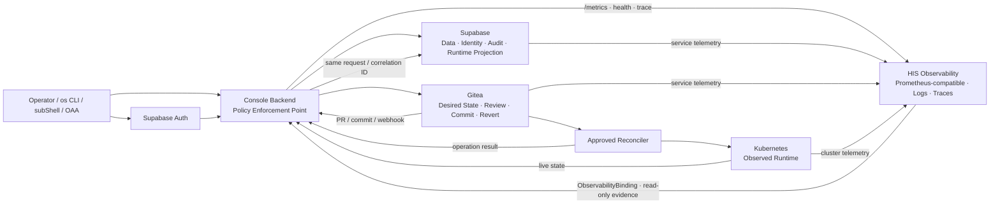

# OpenSphere Console Platform Control Plane 2차 업그레이드 계획

| 항목 | 값 |
|---|---|
| 문서 상태 | **채택된 정본 · Platform Control Plane 2차 구현 기준선** |
| 작성일 | 2026-07-22 |
| 대상 | OpenSphere Console `/manage/*`, Console Backend, Supabase, Gitea, HIS Observability Binding, OAA, Manual, subShell 연계 |
| 상위 결정 | `migration-adr-006` — **Supabase Data & Identity Authority + Gitea Declarative Change Authority** |
| 변경 대상 | 사용자 노출 `/manage/backbone`, legacy `/api/admin/backbone/*`, CBS 명칭·namespace·OAA 잔재 |
| 비목표 | Supabase Studio 복제, Gitea를 workforce SCM으로 사용, 브라우저에 privileged credential 제공 |

---

## 0. 최종 제안

### 0.0 구현 현황 — 2026-07-22

이 계획은 채택 이후 아래 범위까지 실제 반영되었다. 이 표는 설계 목표와 현재
운영 상태를 섞지 않기 위한 구현 ledger다.

| 영역 | 현재 상태 | 검증 기준 |
|---|---|---|
| Data & Identity | self-hosted Supabase가 `opensphere-console-data`에서 Auth·PostgREST·Storage와 Console audit/read model의 권위로 동작 | Console 및 Auth public health 200, Supabase 계약·RLS 정적 시험 |
| Change Control | `opensphere-console-change`의 Gitea가 선언형 변경 repository와 PR/승인 경로를 제공 | protected `main`, 1인 이상 승인, direct push 금지, signed commit 요구 |
| Gitea signing | 서버 전용 SSH signing key를 메모리 볼륨으로 materialize하고 private key를 브라우저·repository에 노출하지 않음 | 실제 ephemeral commit의 SSH signature, key mode `0600`, Gitea health |
| Console 관리면 | Platform Control Plane, Data & Identity, Change Control 화면과 복구 evidence 읽기 모델을 배포 | Console `platform-control-v6`, Backend `platform-control-v4`, 양쪽 Deployment 2/2 Ready |
| HIS Observability | Binding 소비자만 유지. Prometheus/ServiceMonitor/Alertmanager의 설치·수명주기는 Console이 소유하지 않음 | Binding 부재 시 `NotConfigured`, 시계열·SLO·alert를 Ready로 가장하지 않음 |
| legacy CBS/Backbone | 사용자 승인 후 `opensphere-cbs`, `opensphere-backbone` namespace와 해당 legacy PVC/PV를 물리 삭제 | active workload/DNS 참조 0건, legacy namespace/PVC 재조회 결과 없음 |

`change_outbox`와 receipt ledger는 이미 적용되어 있다. 다만 consumer별 자동
reconciler가 등록되기 전에는 변경을 `Applied`로 표시하지 않고 `Queued`로 남긴다.
이는 Gitea merge만으로 Kubernetes 적용 성공을 주장하지 않기 위한 의도적인 gate다.

인증된 화면의 최종 UI 검증은 Console 운영자 세션으로 수행한다. 세션이 없는
상태에서 backend credential이나 브라우저 저장소를 읽어 검증하지 않는다.

### 0.1 명칭과 메뉴

1. 사용자-facing `Backbone` 명칭을 폐기한다.
2. 전체 기반의 상위 개념은 **Platform Control Plane(플랫폼 제어 기반)** 으로 정한다.
3. `Supabase` 하나를 전체 기반 메뉴명으로 사용하지 않는다. Supabase는 Data & Identity 권위이지만 Gitea의 선언형 변경 권위를 포함하지 않기 때문이다.
4. 메뉴는 다음 두 관리면을 독립된 형제로 둔다.

   - **Data & Identity** — 제품 표기 `Supabase`
   - **Change Control** — 제품 표기 `Gitea`

5. `/manage/backbone`은 `/manage/data-identity`로 영구 호환 redirect하고 신규 링크·문서·CLI에서는 사용하지 않는다.
6. Gitea는 Supabase의 tab으로 넣지 않는다. 두 서비스는 권위, 장애 모드, 권한, 복구 및 운영 작업이 다르다.

권장 메뉴는 다음과 같다.

| 그룹 | 메뉴 | Route | 페이지 제목 |
|---|---|---|---|
| 플랫폼 제어 기반 | Overview | `/manage/platform-control` | `Platform Control Plane` |
| 플랫폼 제어 기반 | Data & Identity | `/manage/data-identity` | `Data & Identity — Supabase` |
| 플랫폼 제어 기반 | Change Control | `/manage/change-control` | `Change Control — Gitea` |
| 플랫폼 제어 기반 | OAA Gateway | `/manage/oaa` | `OAA Gateway` |
| 플랫폼 제어 기반 | Observability | `/manage/observability` | `Observability Integration — HIS-provided` |

`Supabase`, `Gitea` 제품 이름은 숨기지 않는다. 메뉴의 역할 이름 옆 badge와 페이지 제목에 명시해 사용자가 실제 공급 기술과 버전을 즉시 알 수 있게 한다.

### 0.2 “모든 정보와 내역을 Gitea로 관리”의 정확한 의미

Gitea가 모든 데이터를 복제해 보관하는 구조는 채택하지 않는다. 다음 경계를 지켜야 단일 권위가 유지된다.

| 정보 | 단일 권위 | 설명 |
|---|---|---|
| 운영자, session, RBAC, 사용자 설정, object metadata, 관리 감사 | Supabase | 관계·검색·보안 정책·고빈도 기록에 적합 |
| 선언형 설정, Manual 원문, OAA tool/binding 선언, subShell descriptor, diff/review/revert | Gitea | 사람이 검토 가능한 변경 내용과 이력 |
| 현재 workload/resource 상태 | Kubernetes API | 실행 현실의 권위 |
| 지표·로그·trace | **HIS Observability**가 소유하는 Prometheus-compatible/log/trace backend | 시간계열·대용량 운영 증거. Console은 Binding을 통한 소비자 |
| 명령 인가, reason, MFA, idempotency, 권위 간 연결 | Console Backend | 유일한 Policy Enforcement Point |

따라서 “Gitea 결합”은 **모든 선언형 변경이 Gitea commit/PR을 통과하고 모든 운영 결과가 동일 request/correlation ID로 Supabase 감사에 연결됨**을 뜻한다. 로그, session, live state를 Git에 중복 저장하지 않는다.

Prometheus, Grafana, Alertmanager, 수집기와 장기보존은 Supabase+Gitea 기반에 포함하지 않는다. 이들은 HIS가 소유하는 관측 capability다. Console은 `/metrics`·health·trace를 노출하고 필요한 관측 조건을 선언하며, HIS가 발급한 `ObservabilityBinding`을 읽기 전용으로 소비한다. PFS는 이 Console↔HIS 계약의 중간 소유자나 필수 경유지가 아니다.

---

## 1. 조사 결과와 현재 기준선

### 1.1 실제 화면

#### Step 1 — 현재 서비스 상태


- 사이드바 표기는 `Supabase`로 변경됐지만 route와 컴포넌트 이름은 `/manage/backbone` 및 `admin-backbone`이다.
- Auth, PostgREST, Storage의 HTTP 응답만으로 ready를 표시한다.
- DB, backup, RLS, latency, error rate, migration drift, storage 사용량을 판정할 수 없다.

#### Step 2 — 현재 Identity & Access


- operator 수, role 세 개, 감사 이벤트 수만 제공한다.
- session, MFA assurance, 로그인 실패, revoke, service principal, role-permission matrix와 만료 grant가 보이지 않는다.

#### Step 3 — 현재 Storage & Audit


- 세 bucket의 이름과 제한만 보인다.
- object/byte 수, 증감, 정책, public exposure, 실패, orphan, retention, backup 증거가 없다.
- Gitea는 설명 문장으로만 존재하고 관리 표면은 없다.

#### Step 4 — OAA 연계


- UI와 runtime 설정에 `CBS consumer workload`, `opensphere-backbone`, 기존 PostgreSQL/RustFS/Gitea 설명이 남아 있다.
- Supabase `oaa` schema와 실제 Gateway runtime의 소유·연결 상태를 한 화면에서 입증하지 못한다.

#### Step 5 — 현재 감사


- `audit.event` 조회와 filtering은 동작한다.
- actor가 UUID 위주이고, intent → authorized → committed → applied/failed 흐름이 하나의 change timeline으로 묶이지 않는다.
- Gitea repo/PR/commit, reconciler operation, subShell/source, rollback 관계를 추적하기 어렵다.

### 1.2 코드·데이터 기반

이미 준비된 좋은 기반은 유지·확장한다.

| 기반 | 현재 구현 | 판정 |
|---|---|---|
| Supabase 상태 API | `/api/identity/supabase/status`가 Auth/PostgREST/Storage, operator, role, audit, bucket을 집계 | 1차 요약 수준 |
| 변경 요청 | `console.change_request`에 actor/action/target/reason/status/Git/K8s correlation 보유 | 핵심 기반 존재 |
| 감사 | `audit.event`에 request/correlation/phase/result/commit/operation/hash chain 보유 | UI 투영 부족 |
| 상관관계 RPC | `begin_change`, `record_change_commit`, `record_reconcile_result` | intent/commit/reconcile 연결 기반 존재 |
| OAA | `oaa` schema에 document, chunk, retrieval trace, tool run, ACL/RLS 보유 | 실제 관리 가시성 부족 |
| Gitea 관측 | Observability에 repo/user/org/issues/releases/access/memory Prometheus query 존재 | 전용 관리면으로 재사용 가능 |
| Gitea API | legacy controller의 `/api/admin/backbone/gitea*`는 anonymous/public read 수준 | 보안·기능 모두 교체 필요 |
| Observability 연계 | Console이 `monitoring` namespace의 Prometheus service를 직접 찾아 query/targets를 호출 | HIS Binding을 통하지 않는 직접 결합 |

### 1.3 확인된 구조적 잔재

- Console Backend 메시지와 readiness에 `Backbone unavailable`, `opensphere-console-backbone`이 남아 있다.
- Dupa Controller에 `/api/admin/backbone/status|detail|yaml|events|pg|pg/rows|pg/function*|controller|claims|gitea*|install`이 남아 있다.
- generic PostgreSQL row/DDL 기능은 Gitea 선언형 write path를 우회하므로 새 UI로 가져오면 안 된다.
- 이전 PostgreSQL/RustFS/Gitea bootstrap은 `archive/legacy-cbs/backend-backbone/`으로 격리한다. 활성 build/deploy/seed 경로가 아니다.
- OAA Gateway와 Nginx에 `opensphere-backbone` DNS/namespace, `BACKBONE_NS`, CBS 설명이 남아 있다.
- 기존 `BACKBONE-ARCHITECTURE.md`는 superseded notice 아래에 구 구조 전체를 보존하고 있어 runtime 문서로 오인될 수 있다.
- Dupa Controller가 `monitoring.coreos.com` 리소스에 광역 create/update/patch/delete 권한을 보유하고 ServiceMonitor를 직접 생성할 수 있다.
- Observability API가 `monitoring` namespace의 service DNS를 직접 탐색한다. 이는 HIS가 소유해야 할 endpoint·tenant·credential·capability 계약을 우회한다.

---

## 2. 설계 원칙

1. **권위가 화면 구조를 결정한다.** 제품을 한 카드에 모으는 것이 아니라 Data/Identity, Declarative Change, Runtime, Policy 권위를 분리한다.
2. **상태에는 증거가 붙는다.** 모든 상태는 source, checked time, threshold, evidence link를 표시한다.
3. **Unknown은 Ready가 아니다.** probe 실패나 freshness 초과는 `Unknown` 또는 `Not Ready`로 명확히 표시한다.
4. **상용 수준의 가시성은 복제가 아니라 설명 가능성이다.** 현재 값, 기간 추세, 영향, 원인, 조치, 증거를 한 흐름으로 제공한다.
5. **Read와 Write를 분리한다.** 관측 API는 read-only, 변경은 reason/MFA/approval/audit/Gitea/reconcile 경로만 허용한다.
6. **브라우저에 privileged credential을 주지 않는다.** Supabase `service_role`, Gitea token, DB owner credential은 Backend/worker Secret만 사용한다.
7. **상관관계 없는 성공은 성공으로 표시하지 않는다.** 요청, commit, reconcile, runtime 결과가 결합되어야 `Applied`다.
8. **subShell은 consumer contract를 선언한다.** 어떤 schema/bucket/repo/path/permission/reconciler/telemetry를 쓰는지 Console이 입증한다.
9. **HIS 경계를 침범하지 않는다.** Console은 Prometheus/Operator/CRD/retention/scrape/Alertmanager를 설치·구성·운영하지 않는다.
10. **관측 환경에 적응한다.** Binding이 없어도 bootstrap·진단·연결 복구 화면은 동작하고, Binding이 준비되면 심층 metric/SLO/alert 기능이 자동 활성화된다.

---

## 3. 목표 구조



### 3.1 페이지 간 공통 연결

각 페이지는 동일한 `request_id`와 `correlation_id`를 URL filter로 받는다.

```text
/manage/data-identity?correlation=<id>
/manage/change-control?correlation=<id>
/manage/audit?correlation=<id>
/manage/oaa?correlation=<id>
/manage/extensions/<consumer>?correlation=<id>
```

한 화면에서 다른 권위로 이동해도 filter와 시간 범위를 유지한다.

---

## 4. 정보 구조와 페이지 설계

### 4.1 `/manage/platform-control` — Control Plane Overview

목적은 “두 제품이 떠 있는가”가 아니라 OpenSphere의 관리 변경 경로가 안전하게 작동하는지 한 화면에서 판정하는 것이다.

#### 상단 요약

- 전체 상태: `Ready | Degraded | Not Ready | Unknown`
- 배포 환경, release revision, image digests, schema migration revision
- 데이터 freshness와 마지막 완전 E2E canary 시각
- 열린 incident, pending/failed change, drift, backup/restore gate

#### 권위 카드

| 카드 | 필수 표시 |
|---|---|
| Supabase | Auth/Data/API/Storage 상태, DB/Storage 사용량, RLS/advisor critical, backup age |
| Gitea | service/API/metrics 상태, repo/PR/webhook/reconcile, drift, backup age |
| Kubernetes | registered cluster, API reachability, reconciler, pending/failed operation |
| Console Backend | policy/audit append/outbox, error rate, latency, queue/unknown change |
| HIS Observability | Binding 상태, provider capability, freshness, scrape coverage, alert/SLO 상태. 미연결 시 설치하지 않고 제한 사유 표시 |

#### Change pipeline

최근 변경을 `Intent → Authorized → PR/Committed → Reconciling → Applied/Failed/Rolled back` 단계로 표시한다. 누락된 단계는 경고한다.

### 4.2 `/manage/data-identity` — Data & Identity (Supabase)

| 영역 | 제공 정보 | 데이터 원천 |
|---|---|---|
| Overview | Auth/PostgREST/Storage/DB health, version/digest, uptime, p50/p95/p99, error rate, incident | direct probes + HIS Observability Binding + deployment metadata |
| Database | schema/table/view/function 수, 크기, top tables, connection/pool, slow query, lock, WAL/backup, extension, migration drift | read-only SQL views + pg stats |
| Auth & Access | operator, status, session, MFA/AAL, sign-in trend/failure, revoke, service principal, role-permission matrix, expiring grant | Auth Admin server API + `console`/auth audit projection |
| APIs | PostgREST schema exposure, request/error/latency/role, RLS enforcement, rate limit | HIS-bound gateway/PostgREST metrics + access logs |
| Storage | bucket/object/bytes/growth, limits, MIME, public exposure, failed upload, orphan, retention, object backup | Storage API + read-only storage metadata + object inventory |
| Advisors | RLS disabled/missing policy, exposed sensitive columns, unused/duplicate index, slow query, insecure function/search path | approved linter/advisor queries |
| Audit & Changes | event volume, hash-chain continuity, phase gap, actor/source/category, correlated changes | `audit.event` + `console.change_request` |
| Security & DR | key/cert rotation metadata, secret age, network policy, DB/object backup, last restore drill, RPO/RTO | Secret metadata only + policy/evidence store |
| Integrations | Manual/OAA/subShell별 schema, bucket, auth, last operation, error | consumer contract projection |

#### 제한

- 임의 SQL editor, generic row editor, DDL function editor를 이 페이지에 제공하지 않는다.
- `auth`와 `storage` 내부 table은 read-only inventory로만 다룬다.
- Storage object 변경은 Storage API를 사용하고 metadata table을 직접 변경하지 않는다.
- secret, token, JWT signing key의 원문은 표시하지 않는다.

### 4.3 `/manage/change-control` — Change Control (Gitea)

| 영역 | 제공 정보 | 데이터 원천 |
|---|---|---|
| Overview | health/version/digest/uptime, repo/org/user/team, PR/issue/release, disk/LFS, runner, backup | Gitea API + HIS Observability Binding + K8s evidence |
| Repositories | 목적, owner, default/protected branch, code owner, last commit, signature, last applied, drift, consumers | Gitea API + consumer contract + reconciler |
| Change Requests | actor/reason/risk, request, PR/review, diff summary, validation, commit, reconcile, outcome | Supabase change request + Gitea API |
| Reconciliation | desired/applied SHA, queue, last duration, failure, drift, operation ID, observed generation | reconciler callback + Kubernetes projection |
| Webhooks | scope, target, event, delivery ID, signature verification, latency, retry/redelivery, last failure | Gitea API + Console webhook receipt ledger |
| Automation | workflow/runner status, pending/failure, token permission mode, trusted runner boundary | Gitea Actions API/metrics |
| Supply Chain | protected branches/tags, signed commits/merges, release/package attestations, unsigned exceptions | Gitea policy/API + verification worker |
| Backup & Restore | last full backup, off-cluster copy, size/checksum, restore drill, RPO/RTO | backup evidence |

#### Write 원칙

- Production 변경은 branch + PR + 승인 + protected branch merge를 기본으로 한다.
- Console Backend만 scoped Gitea credential을 사용한다.
- production direct push와 Gitea admin token은 정상 경로에서 금지한다.
- revert도 새 `change_request`로 생성하며 이전 요청과 `reverts_request_id`로 연결한다.
- webhook은 raw body HMAC 검증, delivery ID idempotency, replay 방지/허용 정책을 적용한다.

### 4.4 `/manage/observability` — HIS Observability Integration

이 페이지는 Prometheus 관리 화면이 아니다. Console이 HIS Observability capability와 어떤 계약으로 연결됐는지 보여주는 **소비자·진단 표면**이다.

#### 2차 업데이트 확정 원칙 — HIS Binding 적응형 소비자

Console은 HIS가 존재한다고 가정하지도, HIS가 없다는 이유로 대체 관측 스택을 만들지도 않는다. 매 요청·화면 갱신에서 `ObservabilityBinding`의 condition, capability, freshness, scope를 평가하여 다음의 두 동작 모드 중 하나를 **명시적으로** 선택한다.

| 조건 | Console 동작 | 금지 사항 |
|---|---|---|
| HIS 또는 유효 Binding이 없음 (`NotConfigured`, `Requested`, `Pending`, `Denied`, `Incompatible`) | Supabase/Gitea/Kubernetes의 direct evidence, audit, bootstrap·복구 안내와 Gitea 기반 Claim 요청만 제공 | Prometheus/Grafana/Alertmanager 설치, `monitoring` 탐색, ServiceMonitor/CRD 생성, 시계열·SLO·alert 결과를 정상처럼 표시 |
| HIS Binding이 유효하고 fresh하며 요청 범위가 허용됨 (`Connected`) | Binding이 허용한 metric/log/trace/alert summary와 query template를 Native Console view에 표시 | Binding scope 밖의 임의 query, credential 원문 노출, HIS lifecycle 변경 |
| Binding이 저하·만료·상실됨 (`Degraded`, `Stale`, `Lost`) | 마지막 정상 증거를 stale로 분리 표시하고 direct evidence·복구 경로로 즉시 강등 | cached telemetry로 Ready 판정, activation/upgrade 승인, HIS를 Console이 직접 복구·재설치 |

이 원칙은 선택적 UX가 아니라 플랫폼 안전 조건이다. HIS Binding 부재는 **제한 상태**이며 오류나 자동 설치 trigger가 아니다. Binding이 정상일 때에도 Console은 읽기 전용 consumer이고, HIS는 수집·저장·규칙·보존·고가용성의 전권 소유자다.

#### Console과 HIS의 책임 경계

| Console | HIS |
|---|---|
| `/metrics`, health, W3C trace context와 telemetry descriptor 노출 | Prometheus-compatible 수집·저장·질의 계층 설치와 운영 |
| 필요한 signal, SLO, alert 요구사항을 선언 | scrape, retention, capacity, HA, Alertmanager, 장기보존 소유 |
| Gitea change request로 `ObservabilityClaim` 요구사항 제출 | Claim 검증·적용 후 `ObservabilityBinding` 발급 |
| Binding의 허용된 query/summary를 읽기 전용 소비 | endpoint, tenant, credential reference, capability와 condition 관리 |
| Native Console view 렌더링 | 다른 HIS/PFS/subShell 대상까지 포함한 공통 관측 기반 운영 |

Console runtime은 `monitoring` namespace, Prometheus service DNS, ServiceMonitor CRD 존재를 임의 탐색해 연결하지 않는다. Console의 광역 monitoring CRD CRUD 권한도 제거한다. 관측 rule/target 변경은 Gitea의 선언형 요청과 HIS reconciler를 통과한다.

Cluster Manager를 포함한 Console module에는 HIS 설치자 permission profile을 제공하지 않는다. module의 권한은 read-only observer 또는 Console 소비자 측 storage integration으로 제한하며, 과거 `cluster-his-manager-v1`처럼 Prometheus Operator·Alertmanager·RBAC escalation을 위임하는 profile과 기존 binding은 제거한다.

#### Binding 최소 계약

```text
providerKind
bindingId / observedRevision
queryEndpointRef / alertEndpointRef
tenantId / credentialRef
capabilities: metrics|logs|traces|alerts|rangeQuery|exemplars
retention / maxRange / freshnessSLO
allowedScopes / labelPolicy / redactionPolicy
status.conditions[] / lastVerifiedAt
```

endpoint credential 원문은 UI·Supabase·Gitea에 저장하지 않는다. Console Backend는 HIS가 발급한 scoped Secret reference만 사용한다.

### 4.5 `/manage/audit` — 통합 Change Timeline 강화

현재 event table을 폐기하지 않고 다음 projection을 추가한다.

```text
Intent → Authorized → PR Opened → Reviewed → Committed
       → Reconcile Started → Applied | Failed → Verified | Rolled back
```

필수 filter:

- time, actor/display name, actor type, source, action, risk, result
- request/correlation ID, Gitea repo/PR/commit, Kubernetes operation
- Manual/OAA/subShell consumer ID, cluster, namespace, target
- missing phase, unknown, failed, rolled back, break-glass

표시 원칙:

- UUID 옆에 현재 display name과 actor type을 표시하되 UUID가 정본임을 유지한다.
- OAA retrieval/Manual ingest와 같은 고빈도 event는 기본 grouping하고 raw event drill-down을 제공한다.
- event hash/prev hash 연속성 검증 상태와 독립 export 상태를 표시한다.

---

## 5. Manual, OAA, subShell 통합 계약

### 5.1 Manual

```text
Gitea Markdown/YAML 원문
  → review/merge/commit
  → signed ingest job
  → Supabase document/version/section/chunk/embedding
  → Manual UI + OAA retrieval
```

관리 화면은 repo/path, commit, source hash, ingest status, document/chunk count, embedding model/revision, ACL, last successful ingest, stale/drift 상태를 표시한다.

### 5.2 OAA

- OAA knowledge, retrieval trace, tool run은 Supabase가 소유한다.
- tool/capability/action binding 선언은 Gitea에서 review한다.
- OAA Gateway에는 Kubernetes write RBAC를 주지 않는다.
- 변경 요청은 Console Backend에서 current permission, MFA, scope, reason을 검증한 후 Gitea PR/commit으로 보낸다.
- OAA 페이지에 `Knowledge lineage`, `Tool governance`, `Recent executions`, `Change correlation`을 추가한다.
- `CBS consumer workload`, `BACKBONE_NS`, 기존 PostgreSQL/RustFS seed 설명을 제거한다.

### 5.3 subShell consumer contract

각 subShell은 다음 contract를 등록해야 한다.

| 계약 | 필수 필드 |
|---|---|
| Identity | required permission, role projection, service principal, last auth verification, MFA requirement |
| Data | Supabase schema/table/view, owner, migration revision, RLS coverage, data size |
| Storage | bucket/prefix, policy, object/bytes, retention, backup class |
| Change | Gitea repo/ref/path, branch policy, approval, reconciler, desired/applied SHA, drift |
| Manual | repo/path, ingest target, source hash, document/chunk count, ACL, stale state |
| OAA | capability/tool binding, permission, risk, confirmation, last retrieval/run |
| Operations | metrics/logs/traces source, health, SLO, incident, last live evidence |

Extensions/subShell detail 페이지는 이 contract를 요약하고, Data & Identity/Change Control/Audit/OAA 화면으로 consumer filter를 유지한 deep link를 제공한다.

---

## 6. Backend/API 및 데이터 계약

### 6.1 외부 관리 read API

| Endpoint | 목적 |
|---|---|
| `GET /api/admin/platform-control/overview` | 전체 권위와 change pipeline 요약 |
| `GET /api/admin/data-identity/overview` | Supabase 서비스/사용량/경보 |
| `GET /api/admin/data-identity/database` | DB inventory/performance/backup |
| `GET /api/admin/data-identity/auth` | operator/session/MFA/RBAC summary |
| `GET /api/admin/data-identity/api` | PostgREST/API traffic/RLS summary |
| `GET /api/admin/data-identity/storage` | bucket/object/policy/backup summary |
| `GET /api/admin/data-identity/security` | advisor/key/cert/policy/DR summary |
| `GET /api/admin/change-control/overview` | Gitea health/capacity/change summary |
| `GET /api/admin/change-control/repos` | repo policy/applied/drift/consumer |
| `GET /api/admin/change-control/changes` | PR/commit/reconcile joined list |
| `GET /api/admin/change-control/reconciliation` | desired/observed pipeline |
| `GET /api/admin/change-control/webhooks` | delivery/verification/retry evidence |
| `GET /api/admin/changes/:requestId/timeline` | 단일 E2E timeline |
| `GET /api/admin/integrations/consumers` | Manual/OAA/subShell contract |
| `GET /api/admin/observability/binding` | HIS Binding, capability, condition, freshness. Secret 원문 제외 |
| `GET /api/admin/observability/summary` | Binding 범위 내 metrics/logs/traces/alerts 요약 |
| `GET /api/admin/observability/query` | Binding이 허용한 scope/template 기반 read query. 임의 provider 탐색 금지 |

모든 response는 다음 공통 envelope를 가진다.

```json
{
  "meta": {
    "schemaVersion": "v1",
    "source": ["supabase", "gitea", "his-observability", "kubernetes"],
    "checkedAt": "RFC3339",
    "freshnessSeconds": 0,
    "partial": false,
    "redactions": []
  },
  "data": {}
}
```

부분 실패를 빈 배열이나 0으로 숨기지 않고 `partial`, component error, last-known timestamp로 전달한다.

### 6.2 내부 write/callback API

| Endpoint | 보호 |
|---|---|
| `POST /api/internal/change-control/gitea/webhook` | HMAC + delivery ID + source allowlist |
| `POST /api/internal/change-control/reconcile-result` | reconciler service principal + mTLS/network policy |
| `POST /api/admin/change-control/requests` | operator JWT + current DB permission + reason + idempotency |
| `POST /api/admin/change-control/requests/:id/approve` | step-up MFA + separation of duties |
| `POST /api/admin/change-control/requests/:id/revert` | 새 change request 생성, 원 요청 연결 |

### 6.3 Supabase read model/view

새 migration은 application table을 복제하지 않고 read-only projection을 제공한다.

```text
internal.platform_component_health_v1
internal.database_inventory_v1
internal.rls_coverage_v1
internal.auth_security_summary_v1
internal.storage_summary_v1
internal.change_timeline_v1
internal.consumer_contract_v1
internal.audit_chain_health_v1
```

- 실행 권한은 Console Backend role에만 준다.
- advisor query는 allowlisted 함수만 사용한다.
- `pg_stat_statements` 등 민감 query text는 literal/secret redaction 후 반환한다.
- dashboard가 직접 임의 SQL을 제출하는 API는 만들지 않는다.

### 6.4 Gitea adapter

legacy anonymous/public read를 다음 adapter로 교체한다.

- read credential: repo/org/team/PR/hook/status read only
- write credential: 전용 org/repo의 branch/content/PR 최소 scope
- webhook secret: API token과 별도 회전
- admin credential: 정상 runtime에 미탑재, break-glass vault에서만 단기 발급
- API 결과 cache는 freshness를 표시하고 권위 데이터로 오인하지 않게 한다.

---

## 7. 상태·가시성·투명성 기준

### 7.1 공통 상태 모델

| 상태 | 의미 |
|---|---|
| Ready | 필수 probe, I/O, freshness, policy gate가 모두 통과 |
| Degraded | 읽기 가능하나 일부 비필수/복구 가능한 기능 실패 |
| Not Ready | auth, audit append, data I/O, Gitea write/reconcile 등 필수 gate 실패 |
| Unknown | 증거 수집 실패 또는 freshness 초과 |

각 상태에는 `reason`, `message`, `lastTransitionAt`, `checkedAt`, `evidenceRef`, `remediation`이 필요하다.

### 7.2 HIS Observability 연결 상태와 적응 동작

Console의 기본 관리 기능과 HIS 기반 심층 관측을 분리한다. Binding 부재는 Console이 HIS를 직접 설치할 이유가 아니라, 제한된 bootstrap/recovery mode로 동작할 조건이다.

| 상태 | Console 표시 | 허용 기능 | 제한·gate |
|---|---|---|---|
| `NotConfigured` | `HIS Observability 미구성`과 필요한 capability 표시 | login, Supabase/Gitea/K8s direct health, audit/change 조회, Claim 초안 생성 | 시계열/SLO/alert 비활성. Platform Production Ready 금지 |
| `Requested` | Gitea change request와 `ObservabilityClaim` 진행 단계 | direct evidence, 요청 취소/수정, HIS condition 조회 | Console이 Prometheus/CRD를 직접 생성하지 않음 |
| `Pending` | HIS가 보고한 reason/message/dependency | direct evidence와 recovery navigation | 신규 PFS/domain activation, platform upgrade 차단 |
| `Connected` | provider, capability, freshness, retention, scope | metric trend, SLO, alert, scrape coverage, correlation 모두 활성 | Binding scope 밖 query 금지 |
| `Degraded` | 실패한 capability와 영향, last-good timestamp | 정상 capability와 direct evidence 유지 | telemetry-dependent high-risk 작업 차단, recovery 작업 허용 |
| `Stale/Lost` | last-known 값을 명확히 stale 처리하고 live 값과 분리 | Supabase/Gitea/K8s direct probe, Binding 재검증 | cached metric으로 Ready 판정 금지; activation/upgrade 차단 |
| `Denied/Incompatible` | policy/version/scope 거부 사유와 remediation | read-only 진단, 새 declarative request | 무한 재시도·권한 우회·직접 설치 금지 |

#### Binding이 없을 때 유지되는 최소 Console evidence

- Supabase Auth/PostgREST/Storage 직접 health와 Console schema/readiness
- Gitea API health와 request/commit correlation
- Kubernetes API reachability와 reconciler의 현재 operation 결과
- audit append, backup/restore evidence, migration revision, credential/certificate expiry metadata
- `HIS Observability unavailable`이라는 명시적 condition과 기능 영향 목록

이 직접 evidence는 bootstrap·복구용 현재 상태이며 Prometheus의 시계열, rate, histogram, alert evaluation을 흉내 내지 않는다.

#### Binding이 준비됐을 때 활성화되는 심층 기능

- p50/p95/p99 latency, request/error rate, saturation과 capacity trend
- scrape/telemetry coverage, SLO burn, active/firing alert
- logs/traces/exemplar deep link와 request/correlation 연결
- 기간 비교, anomaly, saved view, evidence export

### 7.3 상용 수준의 대시보드 원칙

- 기간 선택: 15m, 1h, 6h, 24h, 7d, custom
- 현재값과 추세를 함께 제공
- `무슨 일인가 → 영향은 무엇인가 → 근거는 무엇인가 → 어떻게 조치하는가` 순서의 drill-down
- 상태 카드에서 원본 log/query/metric/evidence로 이동
- CSV/JSON evidence export는 server-side redaction 후 생성
- saved view와 shareable filter URL
- freshness와 수집 실패를 항상 표시
- alert threshold와 SLO를 숨기지 않음

Self-hosted Supabase는 cloud-only reports, managed backup/PITR, advanced platform metrics를 자동 제공하지 않는다. HIS는 Prometheus-compatible observability 기반을 소유하고, Console은 read-only DB views, backup evidence, audit projection과 HIS Binding을 하나의 Native View로 결합한다. 제공하지 않거나 Binding으로 입증하지 못한 기능은 `Ready`로 표시하지 않는다.

---

## 8. 보안 및 복구 기준

1. 관리자 명령은 현재 `console.operator` 상태와 `role_permission`을 매번 재검증한다.
2. high/critical change는 AAL2/step-up MFA와 요청자-승인자 분리를 요구한다.
3. audit intent 기록 실패 시 Gitea/Kubernetes 부작용을 실행하지 않는다.
4. Gitea webhook은 HMAC-SHA256 raw-body 검증과 constant-time 비교를 사용한다.
5. commit/merge signature, protected branch/tag, CODEOWNERS/승인 규칙을 화면에 검증 결과로 표시한다.
6. Gitea Actions runner는 Gitea instance와 분리하고 trust domain을 명시한다.
7. DB, Supabase Storage object, Gitea repo/DB/LFS, Secret은 독립 backup한다.
8. backup은 같은 Supabase/Gitea 장애·삭제 권한 도메인 밖에 보관한다.
9. 마지막 restore drill, checksum, RPO/RTO를 Ready gate에 포함한다.
10. credential 원문, raw session token, service role, private key, Secret data는 UI·log·export에 포함하지 않는다.
11. Console ServiceAccount에 Prometheus Operator/ServiceMonitor/Alertmanager 등 HIS 관측 리소스의 광역 write 권한을 부여하지 않는다.
12. HIS Binding credential은 scoped Secret reference로만 사용하고 Console UI·Supabase·Gitea에 원문을 저장하지 않는다.

---

## 9. legacy 제거·이관 계획

### 9.1 Route와 컴포넌트

| 현재 | 처리 |
|---|---|
| `/manage/backbone` | `/manage/data-identity`로 redirect, telemetry로 잔여 caller 확인 후 문서에서 제거 |
| `admin-backbone.ts` | `admin-data-identity.ts`로 분리·개명 |
| sidebar `Supabase → /manage/backbone` | `Data & Identity → /manage/data-identity`로 변경 |
| `Backbone unavailable` | `Data & Identity unavailable` 또는 component-specific error로 변경 |
| `opensphere-console-backbone` | `opensphere-console-data-identity` logical service name으로 변경 |

### 9.2 legacy API 분류

| API군 | 처리 |
|---|---|
| `/api/admin/backbone/pg/function*` | 즉시 폐기. 선언형 migration/PR 우회 금지 |
| `/api/admin/backbone/pg/rows` | generic browser로 재도입 금지. allowlisted read projection으로 대체 |
| `/api/admin/backbone/controller|claims|install` | CBS 모델과 함께 폐기 |
| `/api/admin/backbone/gitea*` | scoped Gitea adapter의 `/api/admin/change-control/*`로 이관 |
| `/api/admin/backbone/status|detail|yaml|events` | 실제 consumer 확인 후 폐기. 필요한 K8s evidence만 `/api/admin/platform-control/components/*`로 재설계 |
| `/api/admin/observability/status|targets|query*` | URL 호환이 필요하면 유지하되 구현은 HIS Binding adapter로 교체. `monitoring` namespace/service 직접 탐색 제거 |

### 9.3 HIS Observability 직접 결합 제거

| 현재 결합 | 목표 처리 |
|---|---|
| Dupa Controller의 monitoring CRD 광역 CRUD | 제거. Console은 Claim 제출과 자신의 telemetry descriptor 선언만 허용 |
| plugin 등록 시 ServiceMonitor 직접 생성 | descriptor/Claim에 포함하고 HIS reconciler가 정책 검증 후 생성 |
| `monitoring` namespace의 Prometheus/Grafana service 검색 | 제거. `ObservabilityBinding`의 endpoint reference만 사용 |
| 임의 PromQL query proxy | Binding의 allowlisted template/scope query로 제한 |
| Prometheus 미발견 시 단순 빈 화면 | adaptive state machine과 direct evidence mode 제공 |

### 9.4 배포 이름과 namespace

사용자-facing 명칭은 첫 단계에서 제거한다. 물리 namespace 변경은 service DNS, NetworkPolicy, Secret, PVC/backup, OAA cutover가 결합되므로 별도 gate로 수행한다.

권장 최종 경계:

- `opensphere-console-data`: Supabase data/auth/storage 계열
- `opensphere-console-change`: Gitea, webhook/reconciler adapter
- `opensphere-console`: Console Backend, OAA Gateway 등 Console-owned workload

현재 `opensphere-cbs`, `opensphere-backbone`, `BACKBONE_NS`는 transition alias로만 허용하고 신규 코드·문서·metric label에는 추가하지 않는다.

---

## 10. 단계별 구현 계획과 게이트

### Phase 0 — 계획 채택과 계약 고정

산출물:

- 본 계획 승인
- route/menu/API/authority naming ADR 보충
- Gitea org/repo/path/approval/reconciler consumer contract 확정
- 상태·evidence schema v1 확정
- HIS Observability 소유권, Claim/Binding schema와 adaptive state/gate 확정

게이트:

- Supabase/Gitea/Kubernetes/Backend의 canonical writer가 중복되지 않음
- 상위 `migration-adr-006`과 충돌 없음
- Console이 HIS Prometheus/CRD/retention/scrape lifecycle을 소유하지 않음

### Phase 1 — 명칭·IA·legacy 차단

산출물:

- 새 세 route와 메뉴
- `/manage/backbone` redirect
- OAA/CBS 문구 및 Backend error/service name 정리
- dangerous legacy PG DDL endpoint 제거 또는 hard-disabled
- legacy API usage telemetry
- `Observability Integration — HIS-provided` 명칭과 connection state UI
- Console의 monitoring CRD 광역 write 권한과 직접 Prometheus service discovery 제거

게이트:

- `/manage/*`와 CLI/help/docs에 user-facing `Backbone/CBS` 신규 노출 0건
- 기존 bookmark는 로그인/session을 유지하며 새 route로 이동
- redirect/browser E2E 통과
- HIS Binding 미구성 상태에서도 bootstrap/recovery 화면이 오류 없이 동작

### Phase 2 — Evidence plane

산출물:

- 공통 health/evidence envelope
- HIS Observability Binding adapter와 K8s/Supabase/Gitea direct evidence collector
- read-only Supabase views
- partial/freshness/error model
- Control Plane Overview 1차
- `NotConfigured|Requested|Pending|Connected|Degraded|Stale|Denied` 적응 상태 구현

게이트:

- 장애 주입 시 Ready가 유지되지 않음
- 수집 실패가 0/empty로 위장되지 않음
- secret redaction test 통과
- Binding 부재가 Prometheus/ServiceMonitor 자동 설치로 이어지지 않음
- Binding 연결·상실 시 metric UI와 gate가 정확히 활성화·강등됨

### Phase 3 — Data & Identity 심화

산출물:

- Database/Auth/API/Storage/Advisors/Security & DR/Integrations tabs
- Auth audit와 management audit 연결
- RLS/advisor/backup/restore evidence

게이트:

- admin/viewer/disabled 경계 및 RLS negative test
- login/refresh/logout/revoke/MFA 흐름 표시
- DB/object backup과 fresh restore 증거
- 임의 SQL/DDL write path 부재

### Phase 4 — Change Control 심화

산출물:

- scoped Gitea adapter
- Overview/Repos/Changes/Reconciliation/Webhooks/Supply Chain/DR tabs
- Gitea metrics 재사용
- Gitea metric은 HIS Binding을 통해서만 조회
- webhook receipt ledger와 signature verification
- signed commit/protected branch policy projection

게이트:

- anonymous/public repo 의존 0건
- invalid webhook signature/replay 거부
- desired/applied SHA와 drift 표시
- Gitea backup/restore drill 증거

### Phase 5 — Governed change E2E

산출물:

- request → audit intent → PR/review/commit → reconcile → result timeline
- outbox/recovery worker
- unknown/retry/idempotency/rollback 모델
- 승인과 step-up MFA

게이트:

- Supabase, Gitea, reconciler, Kubernetes 장애 주입 통과
- 동일 idempotency key가 중복 commit/apply를 만들지 않음
- audit intent 없이 외부 부작용 0건
- rollback이 새 change request로 연결됨

### Phase 6 — Manual/OAA/subShell 통합

산출물:

- Manual content lineage
- OAA tool/binding/change correlation
- subShell consumer contract와 deep link
- Extensions 상세의 identity/data/change/manual/OAA/operations 카드
- 각 consumer의 ObservabilityClaim/Binding 상태와 capability/freshness projection

게이트:

- Manual commit→ingest→citation lineage 확인
- OAA가 직접 Kubernetes write하지 않음
- subShell별 schema/bucket/repo/path/reconciler/telemetry 누락을 UI가 경고
- consumer filter를 유지한 cross-page E2E 통과
- PFS를 경유하지 않고 HIS Binding으로 telemetry source가 연결됨

### Phase 7 — 물리 잔재 제거

산출물:

- `BACKBONE_NS`, `opensphere-backbone`, `opensphere-cbs` transition 제거
- old bootstrap/deploy/API/archive 분리
- alerts/runbook/release gate 갱신

게이트:

- legacy runtime DNS/API/image/deployment dependency 0건
- rollback window 종료와 독립 backup 승인
- fresh install/upgrade/restore E2E 통과

---

## 11. 전수 시험 기준

| 영역 | 필수 시험 |
|---|---|
| Route/session | old/new deep link, refresh, back/forward, role denial, session 유지 |
| Health | component timeout, stale data, partial source, DB/Storage/Gitea/reconciler 장애 |
| HIS Observability | Binding 미구성/대기/연결/저하/상실/거부, credential revoke, incompatible capability, direct-install 금지 |
| Identity | admin/viewer/disabled/service principal, MFA, revoke, expiring role |
| Data/RLS | positive/negative RLS, service role browser 노출 정적 검사, migration drift |
| Storage | put/get/hash/delete canary, MIME/size deny, orphan, public exposure, restore |
| Gitea | private repo read, protected branch, PR approval, signed commit, webhook invalid/replay |
| Change | intent failure, Gitea success/DB failure, reconcile timeout, duplicate callback, revert |
| Audit | phase continuity, hash chain, actor resolution, correlation filter, export redaction |
| Manual/OAA | source hash, ACL-before-ranking, citation, tool permission, no direct K8s write |
| subShell | missing contract, drift, stale manual, revoked principal, cross-page deep link |
| Accessibility | keyboard tabs/table/tree, focus-visible, status non-color cue, screen-reader label |
| DR | Supabase DB/object, Gitea DB/repo/LFS, Secret restore 후 correlation integrity |

---

## 12. 구현 파일 지도

| 영역 | 주요 대상 |
|---|---|
| Route/menu | `src/app/app.ts`, `src/app/pages/admin-layout.ts` |
| Data & Identity UI | `src/app/pages/admin-backbone.ts` → 신규 `admin-data-identity.ts` |
| Control overview | 신규 `src/app/pages/admin-platform-control.ts` |
| Change Control UI | 신규 `src/app/pages/admin-change-control.ts` |
| Audit | `src/app/pages/admin-audit.ts` |
| OAA/Manual/Extensions | `src/app/pages/admin-oaa.ts`, `src/app/pages/manual.ts`, `src/app/pages/admin-plugins.ts` 및 subShell detail |
| HIS Observability UI | `src/app/pages/admin-observability.ts` — 관리 화면이 아니라 Binding 소비·상태 표면으로 개편 |
| Backend aggregation | `backend/opensphere-console-backend/server.js`를 domain router/adapter로 분리 |
| Supabase migrations | `backend/supabase/migrations/`의 read model, correlation, consumer contract |
| Gitea legacy | `backend/dupa-control/controller.js`의 `/api/admin/backbone/*` 제거·이관 |
| HIS 경계 정리 | `backend/dupa-control/controller.js`의 monitoring CRD 광역 RBAC, ServiceMonitor 직접 생성, service DNS 탐색 제거 |
| OAA runtime | `backend/opensphere-console-oaa-gateway/server.js`, deploy manifest, seed |
| Reverse proxy | `nginx/default.conf.template` |
| Deployment | `backend/supabase/`, `backend/gitea/`, `backend/opensphere-console-oaa-gateway/deploy.yaml`, `backend/opensphere-console-backend/deploy.yaml`, namespace/NetworkPolicy/Secret/backup manifests |
| Tests | route/session, API contract, RLS, webhook, correlation, browser E2E, DR evidence |

Console Backend의 단일 `server.js`에 모든 collector/adapter를 계속 추가하지 않는다. 최소 다음 경계로 분리한다.

```text
platform-control/health
data-identity/supabase-adapter
data-identity/read-model
change-control/gitea-adapter
change-control/webhook
change-control/reconciliation
change-control/timeline
integrations/consumer-contract
observability/his-binding-adapter
observability/direct-evidence
```

---

## 13. 완료 조건

- [ ] 사용자-facing `Backbone/CBS`가 transition 안내 외에는 없다.
- [ ] Supabase와 Gitea가 독립 메뉴이면서 동일 change timeline으로 연결된다.
- [ ] Supabase page가 Auth/Data/API/Storage/Security/DR/Integration의 현재값·추세·증거를 제공한다.
- [ ] Gitea page가 repo/PR/commit/webhook/reconcile/drift/supply-chain/DR의 현재값·추세·증거를 제공한다.
- [ ] 모든 management write가 reason, actor, current permission, MFA, request ID, Gitea revision, reconcile result를 가진다.
- [ ] audit intent가 없으면 외부 write가 실행되지 않는다.
- [ ] Manual/OAA/subShell이 consumer contract로 연결되고 lineage와 권한을 확인할 수 있다.
- [ ] Console은 HIS Observability를 설치·구성하지 않고 Claim/Binding 계약만 사용한다.
- [ ] Binding 부재·대기·정상·저하·상실·거부 상태에서 UI, freshness, 기능 gate가 정의대로 반응한다.
- [ ] Binding이 없어도 bootstrap/recovery와 direct evidence가 동작하며 시계열 기능을 가장하지 않는다.
- [ ] legacy anonymous Gitea, generic PG row/DDL, CBS Claim/install 경로가 runtime에서 제거된다.
- [ ] DB/object/Git/runtime 증거가 독립 복구 후 correlation으로 재결합된다.
- [ ] 장애·보안·접근성·fresh install/upgrade/restore E2E가 통과한다.

---

## 14. 공식 기능 기준과 참고

Supabase 공식 문서에서 self-hosting은 운영·보안·backup·monitoring을 사용자가 직접 책임지며 cloud-only reports와 managed backup/PITR 같은 platform 기능을 자동 제공하지 않는다고 명시한다. 따라서 OpenSphere가 별도의 evidence/observability 계층을 구현해야 한다.

- Supabase self-hosting 책임과 차이: <https://supabase.com/docs/guides/self-hosting>
- Supabase self-hosted Docker/analytics: <https://supabase.com/docs/guides/self-hosting/docker>
- Supabase Reports의 Database/Auth/Storage/API 관측 범위: <https://supabase.com/docs/guides/telemetry/reports>
- Supabase Logs Explorer: <https://supabase.com/docs/guides/telemetry/logs>
- Supabase Auth audit logs: <https://supabase.com/docs/guides/auth/audit-logs>
- Supabase Security/Performance Advisors: <https://supabase.com/docs/guides/database/database-advisors>
- Supabase Storage schema/read-only 원칙: <https://supabase.com/docs/guides/storage/schema/design>
- Supabase backup 주의사항: <https://supabase.com/docs/guides/platform/backups>

Gitea 공식 문서는 Prometheus metrics, repository/user/org/system webhook, HMAC signature/delivery ID, Actions runner, token permission, commit signature 및 backup/restore 계약을 제공한다. OpenSphere Change Control은 이 기능을 Console의 correlation·approval·reconcile 정책과 결합한다.

- Gitea metrics/API configuration: <https://docs.gitea.com/administration/config-cheat-sheet>
- Gitea webhooks와 signature/delivery: <https://docs.gitea.com/next/usage/repository/webhooks>
- Gitea Actions/runner: <https://docs.gitea.com/usage/actions/overview/>
- Gitea Actions token permissions: <https://docs.gitea.com/usage/actions/token-permissions>
- Gitea commit signatures: <https://docs.gitea.com/administration/signing>
- Gitea backup/restore: <https://docs.gitea.com/administration/backup-and-restore>

---

## 15. 최종 불변식

1. **Supabase는 OpenSphere Console의 Data & Identity Authority다.**
2. **Gitea는 선언형 변경 내용과 변경 이력의 Authority다.**
3. **Kubernetes는 실행 상태의 Authority다.**
4. **Console Backend는 명령 인가·정책·감사의 유일한 Enforcement Point다.**
5. **Platform Control Plane UI는 네 권위를 섞지 않고 correlation으로 연결한다.**
6. **증거가 없거나 오래된 상태는 Ready가 아니다.**
7. **모든 선언형 변경은 review 가능한 Git revision으로 남고, 모든 실행 결과는 Supabase 감사와 결합된다.**
8. **Prometheus-compatible metrics/logs/traces 기반은 HIS가 소유하며 Console은 설치자나 관리자가 아니다.**
9. **Console은 telemetry를 노출하고 ObservabilityClaim을 선언하며, HIS가 발급한 Binding만 읽기 전용으로 소비한다.**
10. **PFS는 Console과 HIS Observability 사이의 필수 경유지나 소유자가 아니다.**
